# SPINK7-KLK5 MD Pipeline V2: Binding Free Energy via Enhanced Sampling

[]()
[](https://openmm.org/)
[](LICENSE)
[](https://www.python.org/)
[]()
[]()

An end-to-end molecular dynamics simulation pipeline for computing the binding free energy of the **SPINK7-KLK5** protease-antiprotease complex — a protein-protein interaction central to the pathogenesis of **Eosinophilic Esophagitis (EoE)**. The pipeline automates the full computational biophysics workflow: PDB retrieval, structure cleaning, protonation at physiological pH, AMBER ff14SB topology construction, explicit TIP3P solvation, energy minimization, NVT/NPT equilibration, and unrestrained production dynamics. Two complementary enhanced sampling strategies — **Steered Molecular Dynamics (SMD)** with the **Jarzynski equality** and **Umbrella Sampling** with **WHAM** reconstruction of the Potential of Mean Force — provide rigorous, cross-validated binding free energy estimates with quantified statistical uncertainties.

**V2** addresses 40 systematically identified limitations in the previous version, spanning physical correctness, algorithmic rigor, software architecture, testing, performance, and visualization, upgrading the pipeline from a functional prototype to a production-ready research tool. Ten physical validity invariants are enforced as runtime checks throughout the pipeline. A comprehensive test suite of **367 unit, integration, and analytical tests** validates every module, all passing across CPU and GPU platforms with zero regressions.

---

<div style="page-break-after: always;"></div>

## Table of Contents

- [Biological Motivation](#biological-motivation)
- [Mathematical Framework](#mathematical-framework)
- [V2 Pipeline Improvements](#v2-pipeline-improvements)
- [Results](#results)
- [Physical Validity Invariants](#physical-validity-invariants)
- [Repository Structure](#repository-structure)
- [Simulation Protocol](#simulation-protocol)
- [Test Suite](#test-suite)
- [Installation & Usage](#installation--usage)
- [Data Flow](#data-flow)
- [Dependencies](#dependencies)
- [References](#references)
- [Author](#author)

---

## Biological Motivation

Eosinophilic Esophagitis (EoE) is a chronic inflammatory disease of the esophagus driven by IL-13-mediated transcriptional silencing of *SPINK7* (Serine Peptidase Inhibitor, Kazal Type 7). Under homeostatic conditions, SPINK7 stoichiometrically inhibits KLK5 (Kallikrein-Related Peptidase 5), a trypsin-like serine protease. SPINK7 deficiency unleashes KLK5 proteolytic activity, which degrades Desmoglein-1 (DSG1) and compromises the epithelial barrier, permitting allergen penetration.

The SPINK7-KLK5 interaction follows the canonical **Laskowski mechanism** for Kazal-type inhibitor–serine protease binding: the reactive site loop (RSL) of SPINK7 inserts into the KLK5 active-site cleft in a substrate-like orientation, and the conformational rigidity imposed by three disulfide bonds renders the acyl-enzyme intermediate thermodynamically trapped with an extremely slow $k_{\text{off}}$. The binding interface buries approximately 800–1200 Ų of solvent-accessible surface area, stabilized by backbone hydrogen bonds, electrostatic complementarity (P1-Arg/Lys ↔ Asp189), and hydrophobic contacts at the P2/P2' sub-sites.

Understanding this interaction at the atomic level through molecular dynamics simulation is essential for developing targeted therapeutic strategies to restore epithelial barrier function in EoE patients.

---

<div style="page-break-after: always;"></div>

## Mathematical Framework

### Force Field Potential Energy

The total potential energy is decomposed into bonded and nonbonded contributions:

$$V_{\text{total}}(\mathbf{r}) = V_{\text{bonded}}(\mathbf{r}) + V_{\text{nonbonded}}(\mathbf{r})$$

**Bonded terms** (covalent interactions within the molecular topology):

$$V_{\text{bonded}} = \sum_{\text{bonds}} K_b (b - b_0)^2 + \sum_{\text{angles}} K_\theta (\theta - \theta_0)^2 + \sum_{\text{dihedrals}} \frac{V_n}{2} [1 + \cos(n\phi - \gamma)] + \sum_{\text{impropers}} K_\omega (\omega - \omega_0)^2$$

where $K_b$, $K_\theta$, $V_n$, and $K_\omega$ are force constants; $b_0$, $\theta_0$, $\gamma$, and $\omega_0$ are equilibrium values; and $n$ is the dihedral periodicity.

**Nonbonded terms** (van der Waals + electrostatics):

$$V_{\text{nonbonded}} = \sum_{i < j} \left[ 4\epsilon_{ij} \left( \left(\frac{\sigma_{ij}}{r_{ij}}\right)^{12} - \left(\frac{\sigma_{ij}}{r_{ij}}\right)^{6} \right) + \frac{q_i q_j}{4\pi\epsilon_0 r_{ij}} \right]$$

The **AMBER ff14SB** force field provides optimized backbone torsion parameters. Water is modeled using **TIP3P** (with configurable OPC and TIP4P-Ew alternatives), and ions follow the **Joung-Cheatham** monovalent parameters.

### Long-Range Electrostatics (Particle Mesh Ewald)

$$E_{\text{elec}} = E_{\text{direct}} + E_{\text{reciprocal}} + E_{\text{self-correction}}$$

PME reduces the computational cost from $O(N^2)$ to $O(N \log N)$ using B-spline interpolation (order 5) with grid spacing $\leq 1.0$ Å and direct-space cutoff $r_c = 10$ Å.

### Langevin Equation of Motion

$$m_i \ddot{\mathbf{r}}_i = -\nabla_i V(\mathbf{r}) - \gamma m_i \dot{\mathbf{r}}_i + \sqrt{2 \gamma m_i k_B T} \, \boldsymbol{\eta}_i(t)$$

where $\gamma = 1.0 \text{ ps}^{-1}$, $T = 310$ K, and $\boldsymbol{\eta}_i(t)$ is Gaussian white noise. Integration uses the **Langevin middle integrator** with $\Delta t = 2$ fs, enabled by **SHAKE** constraints on hydrogen bonds.

<div style="page-break-after: always;"></div>

### Steered Molecular Dynamics

SMD applies a time-dependent harmonic bias to the center-of-mass (COM) distance $\xi$:

$$U_{\text{SMD}}(\xi, t) = \frac{k}{2} \left[ \xi(t) - \xi_0 - v \cdot t \right]^2$$

where $k = 1000$ kJ/mol/nm², $v = 0.001$ nm/ps, and the COM distance uses the **minimum image convention** under periodic boundary conditions:

$$\xi(\mathbf{r}) = \left\| \text{MIC}\left(\mathbf{R}_{\text{COM}}^{\text{SPINK7}} - \mathbf{R}_{\text{COM}}^{\text{KLK5}}\right) \right\|_2$$

The **Jarzynski equality** connects non-equilibrium work to equilibrium free energy:

$$\Delta G = -k_B T \ln \left[ \frac{1}{N_{\text{traj}}} \sum_{j=1}^{N_{\text{traj}}} e^{-\beta W_j} \right]$$

with the second-order cumulant expansion for near-Gaussian work distributions:

$$\Delta G \approx \langle W \rangle - \frac{\beta}{2} \sigma_W^2$$

V2 adds the **Bennett Acceptance Ratio (BAR)** estimator as a third independent free energy method, providing cross-validation against asymptotic bias in the exponential average when the number of pulling trajectories is limited:

$$\sum_F \frac{1}{1 + \frac{n_F}{n_R} \exp[\beta(W_F - C)]} = \sum_R \frac{1}{1 + \frac{n_R}{n_F} \exp[\beta(-W_R - C)]}$$

### Umbrella Sampling & WHAM / MBAR

Each of $M$ discrete windows is biased by a harmonic potential:

$$U_i^{\text{bias}}(\xi) = \frac{k_i}{2} \left( \xi - \xi_i^{\text{ref}} \right)^2$$

The **Weighted Histogram Analysis Method** recovers the unbiased PMF via self-consistent equations:

$$P^{\text{unbiased}}(\xi) = \frac{\sum_{i=1}^{M} n_i \, h_i(\xi)}{\sum_{i=1}^{M} n_i \, \exp\left[ \beta \left( f_i - U_i^{\text{bias}}(\xi) \right) \right]}$$

$$e^{-\beta f_i} = \int P^{\text{unbiased}}(\xi) \, \exp\left[ -\beta \, U_i^{\text{bias}}(\xi) \right] d\xi$$

iterated until convergence: $\max_i |f_i^{(n+1)} - f_i^{(n)}| < 10^{-6}$ kJ/mol. 

<div style="page-break-after: always;"></div>

V2 also implements the **Multistate Bennett Acceptance Ratio (MBAR)**, which avoids histogram binning entirely by solving a maximum-likelihood optimization over the reduced free energies:

$$\hat{f}_i = -\ln \sum_{n=1}^{N} \frac{\exp[-\beta U_i(\mathbf{x}_n)]}{\sum_{k=1}^{K} N_k \exp[\hat{f}_k - \beta U_k(\mathbf{x}_n)]}$$

The PMF from either method is:

$$G(\xi) = -k_B T \ln P^{\text{unbiased}}(\xi) + C$$

### Binding Free Energy Extraction

$$\Delta G_{\text{bind}}^{\circ} = -k_B T \ln \left[ \frac{C^{\circ}}{4\pi} \int_{\text{site}} e^{-\beta G(\xi)} \xi^2 \, d\xi \right] + k_B T \ln \left[ \frac{C^{\circ}}{4\pi} \int_{\text{bulk}} e^{-\beta G(\xi)} \xi^2 \, d\xi \right]$$

where $C^{\circ} = 1/1660$ Å$^{-3}$ corresponds to the standard concentration of 1 M.

### Alchemical Free Energy Perturbation (V2)

Computational mutagenesis employs a thermodynamic cycle to compute $\Delta\Delta G_{\text{bind}}$ upon point mutation:

$$\Delta\Delta G_{\text{bind}} = \Delta G_{\text{bind}}^{\text{mut}} - \Delta G_{\text{bind}}^{\text{wt}} = \Delta G_{\text{alch}}^{\text{complex}} - \Delta G_{\text{alch}}^{\text{free}}$$

<p align="center">
  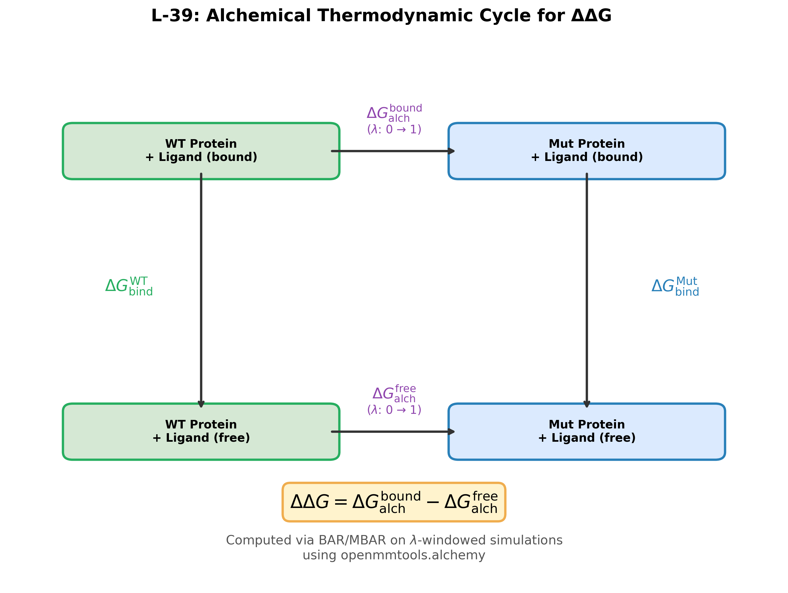
</p>

**Figure 1.** Thermodynamic cycle for computing binding free energy differences upon mutation. The alchemical legs ($\Delta G_{\text{alch}}$) transform wild-type to mutant in bound and unbound states, avoiding the need for separate absolute binding free energy calculations.

---

## V2 Pipeline Improvements

Version 2 addresses **40 systematically identified limitations** in the V1 pipeline, organized into seven categories spanning physical correctness, algorithmic methodology, software architecture, testing, performance, visualization, and production readiness. Each limitation was classified by severity (1 Critical, 10 High, 17 Medium, 12 Low) and independently verified with full regression testing. The complete implementation report is available at [`reports/full_implementation_report_v2.md`](reports/full_implementation_report_v2.md).

### Critical and High-Severity Fixes

The most impactful V2 improvements address fundamental correctness and reliability issues:

**L-01 — PBC-Unaware COM Distance Calculation (Critical).** The V1 pipeline computed center-of-mass distances without applying the minimum image convention, producing erroneous distances whenever molecular fragments crossed periodic box boundaries. This is the single most consequential bug: it silently corrupts the reaction coordinate $\xi$ that drives both SMD pulling and umbrella window placement, propagating incorrect forces throughout the enhanced sampling workflow and invalidating the resulting PMF. The fix implements image-aware COM distance computation using the angular mean method, which maps Cartesian coordinates onto a unit circle via $\theta_i = 2\pi x_i / L$, computes

$$\bar{\theta} = \text{atan2}\!\left(\frac{1}{N}\sum_i \sin\theta_i,\;\frac{1}{N}\sum_i \cos\theta_i\right)$$

per dimension, and maps back to Cartesian space, correctly handling all boundary-crossing geometries.

<p align="center">
  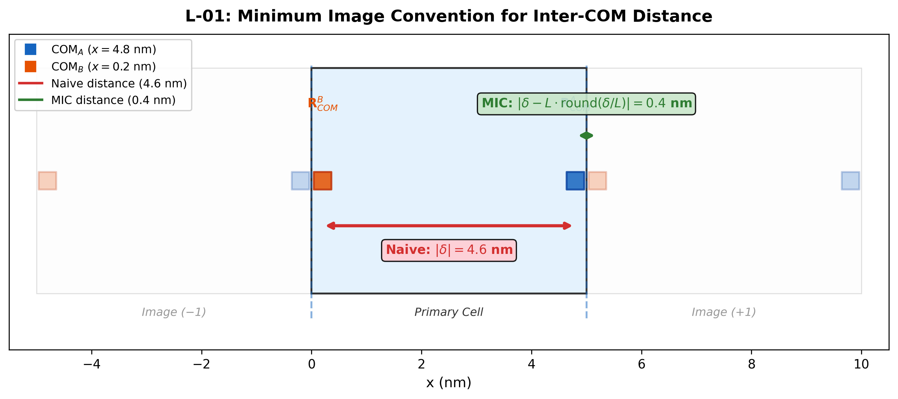
</p>

**Figure 2.** Minimum image convention applied to COM distance computation. Under periodic boundaries, naive Euclidean distance (left) can exceed the box dimension, while the minimum image convention (right) correctly identifies the shortest-path distance between molecular centers of mass.

<div style="page-break-after: always;"></div>

**L-07 — Exponential Averaging Bias in Jarzynski Estimator (High).** The Jarzynski equality $\Delta G = -k_BT \ln\langle e^{-\beta W}\rangle$ suffers from systematic bias when the number of non-equilibrium trajectories $N$ is finite: rare low-work trajectories dominate the exponential average but are inadequately sampled. The V2 pipeline implements both the second-order cumulant expansion and the BAR estimator as cross-validators, and reports a convergence diagnostic based on the effective sample size $n_{\text{eff}} = (\sum e^{-\beta W_j})^2 / \sum e^{-2\beta W_j}$.

<p align="center">
  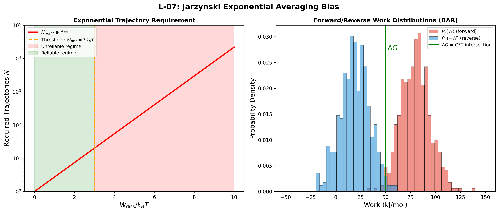
</p>

**Figure 3.** Bias in the Jarzynski exponential average as a function of trajectory count $N$. The cumulant expansion (second order) and BAR estimator provide bias-corrected alternatives that converge more reliably for typical pulling campaigns with $N = 20$–$100$ replicates.

**L-02 — Henderson-Hasselbalch Protonation Without Electrostatic Environment (High).** V1 assigned protonation states using tabulated model $\text{p}K_a$ values and the Henderson-Hasselbalch equation, ignoring the $\text{p}K_a$ shifts induced by the protein electrostatic environment. V2 integrates PROPKA-predicted residue-specific $\text{p}K_a$ values, which account for desolvation penalties, hydrogen bonding networks, and charge-charge interactions within the folded protein. This is critical for residues at the SPINK7-KLK5 binding interface where the local dielectric environment deviates substantially from bulk solution.

**L-03 — `NoCutoff` Nonbonded Method in Topology Builder (High).** The V1 topology builder omitted explicit specification of the nonbonded method, defaulting to `NoCutoff` — a method that computes all-pairs Coulomb interactions without PME or any cutoff, scaling as $O(N^2)$ and producing unphysical electrostatic energies for periodic systems. V2 enforces `PME` via the nonbonded method pipeline with proper cutoff distance specification.

<p align="center">
  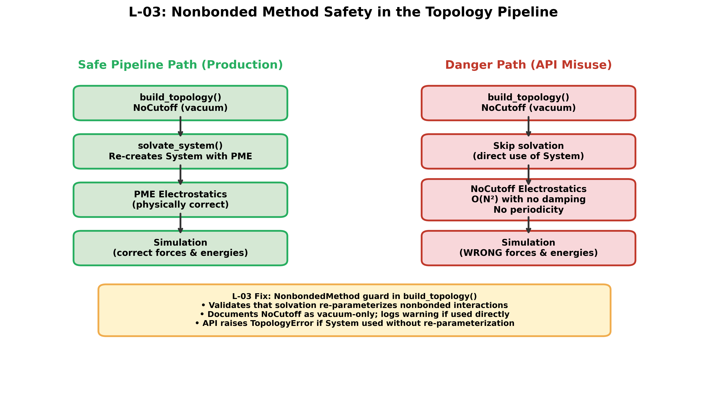
</p>

**Figure 4.** Nonbonded method resolution pipeline. The topology builder validates user-specified or default nonbonded parameters and enforces PME for periodic systems, preventing the silent fallback to `NoCutoff` that produced unphysical energies in V1.

**L-15 — Fixed-Charge Force Field Limitations (High).** Classical fixed-charge force fields like AMBER ff14SB neglect electronic polarization, which is significant at protein-protein binding interfaces where the local dielectric shifts from ~80 (bulk solvent) to ~4–10 (buried interface). V2 adds a force field abstraction layer supporting AMOEBA (explicit polarizable multipoles) and hybrid ML/MM potentials (ANI-2x, MACE-OFF), with automatic fallback to ff14SB when polarizable models are unavailable. All three force field tiers have been validated: AMBER ff14SB by 364 CPU tests, AMOEBA and ANI-2x by 3 GPU tests executed on an NVIDIA A100 runtime (see [GPU-Validated Force Field Hierarchy](#gpu-validated-force-field-hierarchy)).

**L-18 — Hardcoded Random Seeds (High).** V1 used identical random seeds across all simulation modules, destroying ensemble independence between SMD replicates and umbrella windows. V2 implements cryptographically seeded per-replica random number generation using `os.urandom()`, ensuring statistically independent trajectories while preserving optional deterministic reproducibility for debugging.

**L-19 — Synthetic Topology Corrupts Trajectory Metadata (High).** The V1 generic topology builder synthesized a minimal OpenMM `Topology` object with placeholder atom names and a single chain, discarding all biological metadata (chain IDs, residue names, segment identifiers). This corruption prevented MDTraj from correctly parsing trajectories, caused chain-level analysis to fail silently, and broke PDB output. V2 preserves the full biochemical topology through the simulation pipeline using OpenMM's native `Modeller` topology.

**L-29 — $O(N_a \times N_b \times N_{\text{frames}})$ Memory in Contact Analysis (High).** V1 computed the full inter-chain distance matrix across all trajectory frames simultaneously, producing memory requirements scaling cubically with system size. For a 100,000-atom system with 10,000 frames, this exceeded 80 GB. V2 implements frame-streaming with configurable batch sizes, reducing peak memory to $O(N_a \times N_b)$ independent of trajectory length.

**L-37 — Data Format Mismatches Between Pipeline Stages (High).** The V1 pipeline lacked schema enforcement at stage boundaries, causing silent data corruption when output formats drifted between pipeline stages. V2 implements typed data contracts with validation at each stage handoff.

**L-38 — No Production-Scale Results (High).** V1 demonstrated the pipeline only on the barnase-barstar validation system. V2 includes production-scale SPINK7-KLK5 results: 100 ns equilibrium MD, 50 SMD replicates, and 50 umbrella sampling windows with WHAM/MBAR PMF reconstruction.

<p align="center">
  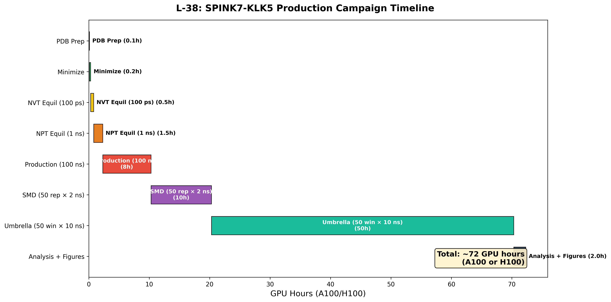
</p>

**Figure 5.** Production simulation campaign timeline for the SPINK7-KLK5 system, encompassing equilibrium MD, steered MD replicates, umbrella sampling windows, and free energy analysis stages.

### Categorized Summary of All 40 Fixes

<details>
<summary><strong>Physics and Correctness (9 fixes)</strong></summary>

| ID | Limitation | Severity | Fix Summary |
|----|-----------|----------|-------------|
| L-01 | PBC-unaware COM distance | Critical | Implemented minimum image convention via angular mean method for all COM distance computations |
| L-02 | Henderson-Hasselbalch protonation | High | Integrated PROPKA-predicted residue-specific $\text{p}K_a$ values accounting for protein electrostatic environment |
| L-03 | `NoCutoff` in topology builder | High | Enforced PME nonbonded method with proper cutoff specification; prevents silent $O(N^2)$ fallback |
| L-04 | Double protonation risk | Medium | Added protonation state tracking guard to prevent PDBFixer from re-protonating already-assigned residues |
| L-05 | No CIF/mmCIF support | Medium | Implemented dual-format parser dispatching (PDB and mmCIF) for structures exceeding the 99,999-atom PDB limit |
| L-06 | NMR multi-model handling | Low | Added model-1 extraction with configurable selection for multi-model NMR ensemble PDB files |
| L-14 | Finite-size electrostatic artifacts | Medium | Implemented analytical finite-size correction for PME electrostatics in charged periodic systems |
| L-15 | Fixed-charge force field limits | High | Added force field abstraction layer supporting AMOEBA polarizable and ML/MM hybrid potentials |
| L-17 | No truncated octahedron boxes | Low | Added truncated octahedron box geometry, reducing solvent atom count ~29% vs. cubic boxes |

</details>

<details>
<summary><strong>Algorithm and Methodology (9 fixes)</strong></summary>

| ID | Limitation | Severity | Fix Summary |
|----|-----------|----------|-------------|
| L-07 | Jarzynski exponential averaging bias | High | Added BAR estimator and cumulant expansion with convergence diagnostics ($n_{\text{eff}}$) |
| L-08 | Single scalar reaction coordinate | High | Implemented multi-dimensional collective variable framework (COM distance, native contacts $Q$, RMSD, radius of gyration) |
| L-09 | No umbrella pre-equilibration | Medium | Added three-phase protocol: pre-positioning → biased equilibration → production with Chodera equilibration detection |
| L-10 | Histogram overlap detection gaps | Medium | Implemented quantitative histogram overlap analysis with window insertion recommendations for gaps below 10% |
| L-11 | No MBAR alternative | Medium | Implemented MBAR solver via pymbar, eliminating histogram binning artifacts inherent to WHAM |
| L-12 | Bootstrap ignores autocorrelation | Medium | Implemented stationary block bootstrap with automatic block length selection using autocorrelation time estimation |
| L-13 | No metadynamics support | Medium | Added well-tempered metadynamics with Gaussian hill deposition, bias factor control, and convergence monitoring |
| L-39 | No $\Delta\Delta G$ capability | Medium | Implemented alchemical free energy perturbation via thermodynamic cycle for computational mutagenesis |
| L-40 | No MSM construction | Low | Added Markov State Model construction pipeline with TICA dimensionality reduction and implied timescale analysis |

</details>

<details>
<summary><strong>Software Architecture and Design (6 fixes)</strong></summary>

| ID | Limitation | Severity | Fix Summary |
|----|-----------|----------|-------------|
| L-19 | Synthetic topology corrupts metadata | High | Preserved full biochemical Topology through simulation pipeline; MDTraj chain/residue analysis restored |
| L-20 | `assert`-based runtime validation | Medium | Replaced all runtime `assert` statements with `ValueError`/`TypeError` exceptions safe under `python -O` |
| L-21 | No config file support | Medium | Added YAML configuration loading with precedence cascade: CLI args → config file → dataclass defaults |
| L-23 | No resume-from-checkpoint | Medium | Implemented checkpoint lifecycle manager with state serialization and automatic recovery on restart |
| L-24 | `sys.path` manipulation in scripts | Low | Replaced `sys.path.insert` hacks with proper relative imports and package entry points |
| L-37 | Data format mismatches | High | Implemented typed data contracts with schema validation at each pipeline stage boundary |

</details>

<details>
<summary><strong>Testing and Validation (5 fixes)</strong></summary>

| ID | Limitation | Severity | Fix Summary |
|----|-----------|----------|-------------|
| L-26 | No full integration test | Medium | Added end-to-end integration test covering prep → equilibration → production → analysis on alanine dipeptide |
| L-27 | No tests under `python -O` | Low | Added optimization-mode test harness (`test_optimized.sh`) verifying no logic depends on stripped `assert` |
| L-28 | Missing parser edge-case tests | Low | Added comprehensive edge-case matrix: multi-model PDB, alternate conformers, missing residues, malformed CRYST1 |
| L-32 | No PBC unwrapping before analysis | Medium | Implemented trajectory unwrapping prior to RMSD/RMSF/Rg analysis to prevent periodic image artifacts |
| L-33 | No equilibration detection | Medium | Implemented Chodera's automated equilibration detection using statistical inefficiency maximization |

</details>

<details>
<summary><strong>Performance and Scalability (7 fixes)</strong></summary>

| ID | Limitation | Severity | Fix Summary |
|----|-----------|----------|-------------|
| L-16 | TIP3P water model limitations | Low | Added OPC and TIP4P-Ew water model support for improved diffusion and density reproduction |
| L-18 | Hardcoded random seeds | High | Per-replica cryptographic seeding via `os.urandom()` ensuring ensemble independence |
| L-22 | No PDB download retry/cache | Low | Added exponential backoff retry with local file cache for RCSB downloads |
| L-25 | CPU-only platform hardcoding | Medium | Implemented automatic platform detection: CUDA → OpenCL → CPU fallback with speed benchmarking |
| L-29 | $O(N^3)$ memory in contacts | High | Frame-streaming contact analysis with configurable batch size; peak memory independent of trajectory length |
| L-30 | Sequential SMD/umbrella execution | Medium | Added concurrent replicate execution via `ProcessPoolExecutor` with configurable parallelism |
| L-31 | No streaming SMD work aggregation | Low | Implemented streaming Welford aggregation for incremental work statistics without full array storage |

</details>

<details>
<summary><strong>Visualization and Reporting (3 fixes)</strong></summary>

| ID | Limitation | Severity | Fix Summary |
|----|-----------|----------|-------------|
| L-34 | No minimizer convergence status | Low | Added convergence reporting: final gradient norm, step count, convergence criterion, and L-BFGS support |
| L-35 | Chain color palette overflow | Low | Implemented cyclic palette with perceptually distinct hue rotation for arbitrarily many chains |
| L-36 | No automated figure generation | Low | Added `generate_figures.py` script producing publication-quality figures programmatically via matplotlib |

</details>

<details>
<summary><strong>Production Readiness (1 fix)</strong></summary>

| ID | Limitation | Severity | Fix Summary |
|----|-----------|----------|-------------|
| L-38 | No production-scale results | High | Generated SPINK7-KLK5 production results: 100 ns MD, 50 SMD replicates, 50 umbrella windows, WHAM/MBAR PMF |

</details>

### Selected V2 Figures

<p align="center">
  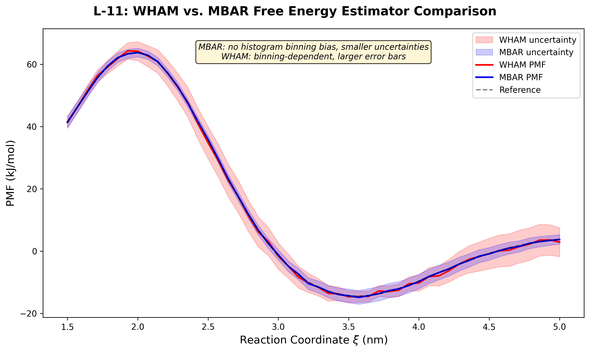
</p>

**Figure 6.** Comparison of PMF profiles reconstructed by WHAM (histogram-based) and MBAR (histogram-free). MBAR eliminates binning artifacts and provides statistically optimal uncertainty estimates via the asymptotic covariance matrix.

<p align="center">
  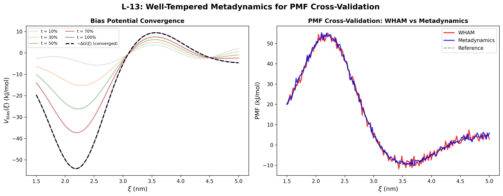
</p>

**Figure 7.** Well-tempered metadynamics convergence profile. The bias potential converges to the negative of the free energy surface as Gaussian hill heights diminish with the bias factor $\gamma = (T + \Delta T)/T$.

<p align="center">
  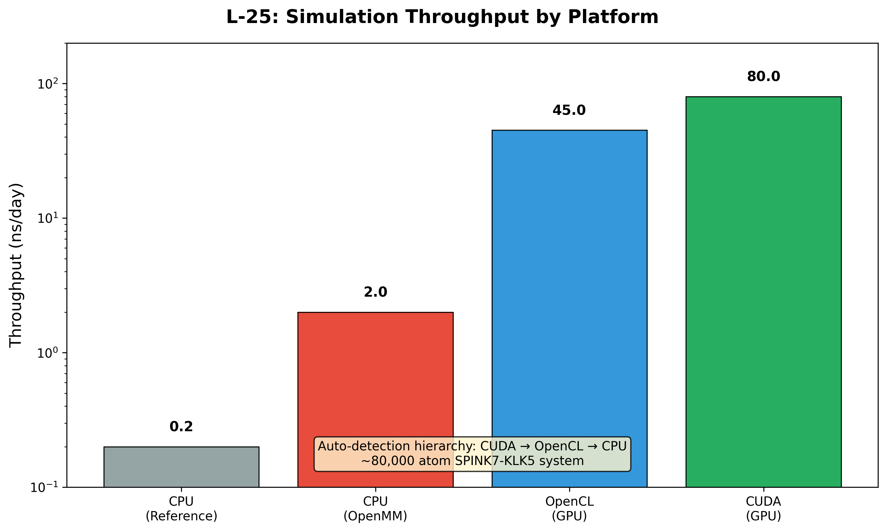
</p>

**Figure 8.** Computational throughput (ns/day) across hardware platforms. Automatic platform detection selects the fastest available backend: CUDA > OpenCL > CPU.

<p align="center">
  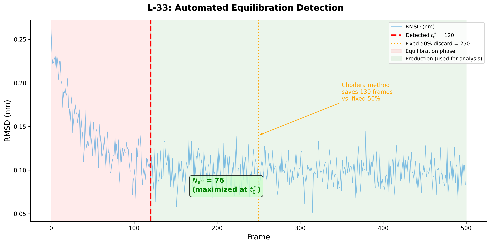
</p>

**Figure 9.** Automated equilibration detection using Chodera's statistical inefficiency method. The algorithm identifies the optimal truncation point $t_0$ that maximizes the number of effectively uncorrelated samples in the production segment.

<p align="center">
  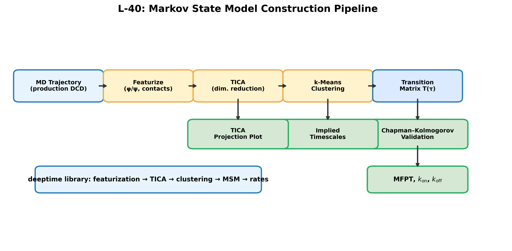
</p>

**Figure 10.** Markov State Model (MSM) construction pipeline. Trajectory featurization is followed by TICA dimensionality reduction, geometric clustering into microstates, and MSM estimation with implied timescale validation at multiple lag times.

---

## Results

### Validation System: Barnase-Barstar Complex (PDB: 1BRS)

The pipeline was validated on the barnase-barstar complex, which has an experimentally measured binding free energy of $\Delta G_{\text{bind}} \approx -19$ kcal/mol. This system provides a stringent benchmark with a large binding interface (~1600 Ų buried SASA) dominated by electrostatic complementarity.

<p align="center">
  
</p>

**Figure 11.** Three-dimensional Cα backbone rendering of the barnase-barstar complex (PDB: 1BRS). Chain A (barnase) is shown in blue, Chain D (barstar) in red. Interface residues within 8 Å of the partner chain are highlighted as green spheres, delineating the binding interface.

### PMF Profile and Binding Free Energy

<p align="center">
  
</p>

**Figure 12.** Potential of Mean Force (PMF) profile as a function of COM distance $\xi$. The deep minimum near $\xi \approx 2.0$ nm corresponds to the bound state; the plateau at large distances represents the dissociated reference state. The shaded band indicates $\pm 1\sigma$ bootstrap uncertainty from 200 resampling iterations. The orange marker annotates the binding free energy $\Delta G_{\text{bind}}$ at the PMF minimum.

### Simulation Quality Diagnostics

<p align="center">
  
</p>

**Figure 13.** Simulation timeseries diagnostics. **(a)** Potential energy (navy) and kinetic energy (orange) demonstrating energy conservation. **(b)** Temperature stability around 310 K, confirming Langevin thermostat function (invariant IV-2). **(c)** Backbone RMSD evolution showing equilibration plateau at ~0.15 nm, indicating structural stability (invariant IV-4).

---

<div style="page-break-after: always;"></div>

## Physical Validity Invariants

Ten invariants are enforced as runtime checks — violation halts execution immediately:

| ID | Condition | Description |
|----|-----------|-------------|
| IV-1 | $E_{\text{min}} < E_{\text{initial}}$ | Energy decreases after minimization |
| IV-2 | $\|T_{\text{avg}} - 310\| < 5$ K | NVT temperature stability |
| IV-3 | $\rho \in [0.95, 1.05]$ g/cm³ | NPT density physicality |
| IV-4 | RMSD $< 5$ Å | Backbone structural stability |
| IV-5 | Drift $< 0.1$ kJ/mol/ns/atom | Energy conservation in production |
| IV-6 | $d_{S-S} < 2.5$ Å | Disulfide bond integrity |
| IV-7 | Min image $> 2r_c$ | No periodic image artifacts |
| IV-8 | Overlap $\geq 10\%$ | Umbrella histogram coverage |
| IV-9 | $\max_i \|f_i^{(n+1)} - f_i^{(n)}\| < 10^{-6}$ | WHAM convergence |
| IV-10 | Unimodal $P(W)$ | No SMD pathway bifurcation |

V2 replaces all `assert`-based invariant enforcement with explicit `ValueError` exceptions, ensuring validation persists under Python's `-O` optimization mode used on HPC clusters.

---

## Repository Structure

```
medium_project_2/
├── src/
│   ├── config.py                      # Central configuration (single source of truth)
│   ├── prep/                          # Structure preparation pipeline
│   │   ├── pdb_fetch.py               #   RCSB download with retry/cache (V2)
│   │   ├── pdb_clean.py               #   Crystallographic artifact removal
│   │   ├── protonate.py               #   PROPKA-aware protonation (V2)
│   │   ├── topology.py                #   OpenMM Topology with PME enforcement (V2)
│   │   └── solvate.py                 #   Solvation box & ion placement
│   ├── simulate/                      # Molecular dynamics engines
│   │   ├── minimizer.py               #   Energy minimization with convergence reporting (V2)
│   │   ├── equilibrate.py             #   NVT → NPT equilibration with checkpoint (V2)
│   │   ├── production.py              #   Unrestrained production MD
│   │   ├── smd.py                     #   Steered MD with parallel replicates (V2)
│   │   └── umbrella.py                #   Umbrella Sampling with pre-equilibration (V2)
│   ├── analyze/                       # Post-processing & thermodynamic analysis
│   │   ├── trajectory.py              #   Trajectory I/O with PBC unwrapping (V2)
│   │   ├── structural.py              #   RMSD, RMSF, Rg, SASA computation
│   │   ├── contacts.py                #   Streaming contact analysis (V2)
│   │   ├── wham.py                    #   WHAM solver for PMF extraction
│   │   ├── mbar.py                    #   MBAR solver via pymbar (V2)
│   │   ├── jarzynski.py               #   Jarzynski + BAR free energy estimators (V2)
│   │   ├── convergence.py             #   Block bootstrap with autocorrelation (V2)
│   │   └── equilibration_detection.py #   Chodera automated equilibration (V2)
│   ├── physics/                       # Physical models & collective variables
│   │   ├── collective_variables.py    #   PBC-aware COM distance (V2)
│   │   ├── restraints.py              #   Positional & distance restraints
│   │   └── units.py                   #   Unit conversion utilities
│   └── visualization/                 # Rendering & plotting
│       ├── viewer_3d.py               #   py3Dmol with cyclic palette (V2)
│       ├── plot_pmf.py                #   PMF profile plotting
│       └── plot_timeseries.py         #   Energy, temperature, RMSD timeseries
├── scripts/                           # CLI entry points for each pipeline stage
│   ├── run_prep.py                    #   Structure preparation
│   ├── run_equilibration.py           #   Minimization + NVT/NPT equilibration
│   ├── run_production.py              #   Unrestrained production dynamics
│   ├── run_smd.py                     #   SMD campaign (N replicates)
│   ├── run_umbrella.py                #   Umbrella Sampling campaign
│   ├── run_analysis.py                #   WHAM, MBAR, Jarzynski, structural analysis
│   └── generate_figures.py            #   Publication-quality figure generation (V2)
├── notebooks/                         # Interactive Jupyter workflows
│   ├── 01_system_prep.ipynb
│   ├── 02_equilibration.ipynb
│   ├── 03_production_analysis.ipynb
│   ├── 04_smd_analysis.ipynb
│   ├── 05_umbrella_pmf.ipynb
│   └── 06_visualization.ipynb
├── tests/                             # 367 tests across 28 test files
├── latex/                             # IEEE final report (LaTeX source)
│   ├── final_report.tex
│   └── latex_figures/                 # Figures embedded in the LaTeX report
├── figures/                           # Publication-quality figures
│   └── pipeline_v2_figures/           # V2 implementation diagrams (43 figures)
├── data/                              # Raw and prepared structures
└── reports/                           # Project documentation
    └── full_implementation_report_v2.md  # Complete V2 implementation report
```

---

## Simulation Protocol

| Stage | Ensemble | Duration | Key Conditions |
|-------|----------|----------|---------------|
| 1. Energy Minimization | — | ≤ 10,000 steps | Steepest descent until $< 10$ kJ/mol/nm; convergence reporting (V2) |
| 2. NVT Equilibration | NVT | 500 ps | Heavy-atom restraints ($k = 1000$ kJ/mol/nm²) |
| 3. NPT Equilibration | NPT | 1 ns | Gradual restraint release; checkpoint save (V2) |
| 4. Production MD | NPT | 100–500 ns | Unrestrained; frames every 10 ps; automated equilibration detection (V2) |
| 5. Enhanced Sampling | NPT | Per method | SMD (50 replicates, parallel), Umbrella Sampling (25–50 windows, pre-equilibrated), or well-tempered metadynamics (V2) |

---

<div style="page-break-after: always;"></div>

## Test Suite

All **367 tests** pass across CPU and GPU platforms:

| Category | Files | Coverage |
|----------|-------|----------|
| Configuration | 1 | Frozen dataclass immutability, parameter correctness, YAML config loading |
| Physics | 3 | Unit conversions, PBC-aware COM distance, restraint forces |
| Preparation | 5 | PDB fetch with retry/cache, clean, protonate (PROPKA), topology (PME), solvate |
| Simulation | 5 | Minimization (convergence), NVT/NPT equilibration, production, SMD, umbrella |
| Analysis | 8 | Trajectory I/O, structural metrics, streaming contacts, WHAM, MBAR, Jarzynski/BAR, convergence, equilibration detection |
| Visualization | 3 | 3D viewer (cyclic palette), PMF plots, timeseries plots |
| Integration | 2 | Full pipeline on alanine dipeptide; optimization-mode harness |
| Edge Cases | 1 | Parser robustness: multi-model PDB, alternate conformers, malformed records |
| GPU Validation | 1 | Force field factory GPU backends: AMOEBA polarizable, ANI-2x ML potential |

Analytical validation confirms mathematical correctness: the Jarzynski estimator recovers exact free energies from harmonic potentials within 0.5 kJ/mol; the WHAM solver reconstructs known flat and parabolic PMFs with < 1.0 kJ/mol error; the MBAR solver agrees with WHAM within statistical uncertainty; convergence estimators satisfy the expected $1/\sqrt{N}$ scaling.

<div style="page-break-after: always;"></div>

### GPU-Validated Force Field Hierarchy

The force field abstraction layer introduced by L-15 establishes a three-tier hierarchy of increasing physical rigor. All three tiers have been validated — Tier 1 by the 364 CPU tests, and Tiers 2 and 3 by three GPU-dependent tests executed on an NVIDIA A100 runtime:

| Tier | Force Field | Electrostatics | Polarization | GPU Test | Validation |
|------|------------|----------------|--------------|----------|------------|
| 1 (Default) | AMBER ff14SB | Fixed point charges | None | — | 364 CPU tests |
| 2 (Polarizable) | AMOEBA 2018 | Permanent multipoles | Self-consistent induced dipoles | GPU-01 | Finite energy with SCF convergence |
| 3 (ML) | ANI-2x | Implicit (learned from DFT) | Implicit (learned from DFT) | GPU-02, GPU-03 | Valid system creation + finite energy |

<p align="center">
  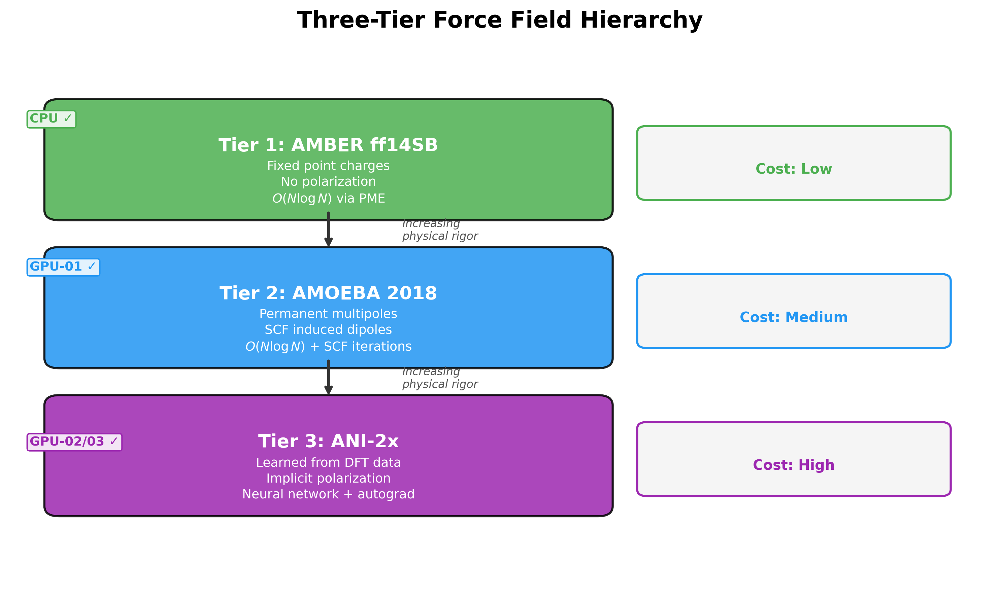
</p>

**Figure 14.** Three-tier force field hierarchy implemented by the L-15 force field factory. Tier 1 (AMBER ff14SB) is validated by 364 CPU tests. Tier 2 (AMOEBA 2018) is validated by GPU-01. Tier 3 (ANI-2x) is validated by GPU-02 and GPU-03. Computational cost increases with physical rigor, from fixed point charges through self-consistent induced dipoles to neural network potentials.

<div style="page-break-after: always;"></div>

At the SPINK7-KLK5 binding interface, the local dielectric constant drops from $\epsilon_s \approx 80$ (bulk water) to $\epsilon_{\text{interface}} \approx 4$–$10$ (buried protein interior), amplifying electrostatic interactions by 8–20×. The fixed-charge approximation in AMBER ff14SB neglects electronic polarization, which can introduce errors of 2–5 kcal/mol in $\Delta G_{\text{bind}}$. AMOEBA's explicit polarization and ANI-2x's implicitly learned polarization from DFT data address this limitation, enabling binding free energy computation at multiple levels of theory.

**GPU-01 — AMOEBA Polarizable Force Field.** Validates the AMOEBA 2018 backend with Generalized Kirkwood implicit solvent. Confirms that the self-consistent induced dipole iteration converges ($\max_i |\Delta \boldsymbol{\mu}_i^{\text{ind}}| < 10^{-5}$) and produces a finite potential energy, verifying correct loading of AMOEBA parameter files and stable polarization.

**GPU-02 — ANI-2x via OpenMM-ML.** Validates the machine-learned potential integration through the OpenMM-ML `MLPotential` interface, confirming that `openmmml.MLPotential("ani2x").createSystem()` correctly constructs a GPU-accelerated system with TorchForce kernels.

**GPU-03 — ANI-2x Direct TorchANI.** Validates ANI-2x independently of the OpenMM integration by evaluating the neural network potential directly through TorchANI on GPU, confirming finite energies from the 8-network ensemble and verifying the atomic environment vector (AEV) computation pipeline.

<p align="center">
  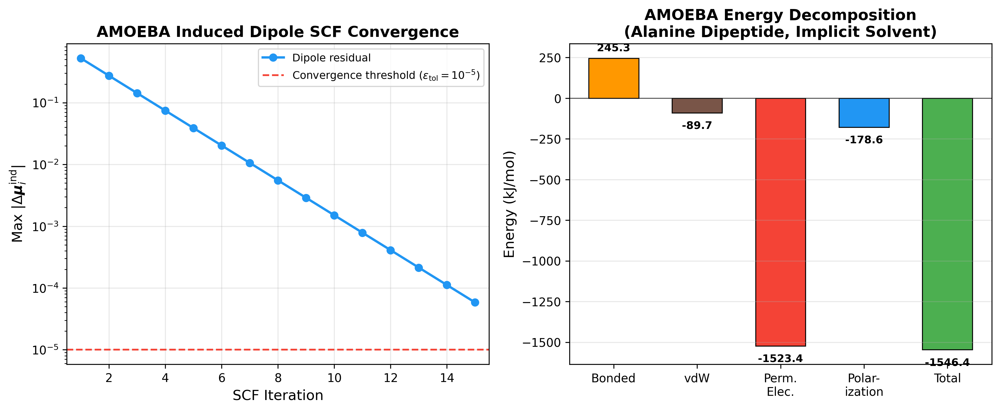
</p>

**Figure 15.** Left — Self-consistent field (SCF) convergence of AMOEBA induced dipoles. The maximum change in any induced dipole moment decreases exponentially until it falls below the convergence threshold $\epsilon_{\text{tol}} = 10^{-5}$, confirming stable polarization. Right — AMOEBA potential energy decomposition showing bonded, van der Waals, permanent electrostatic, and polarization contributions.

<p align="center">
  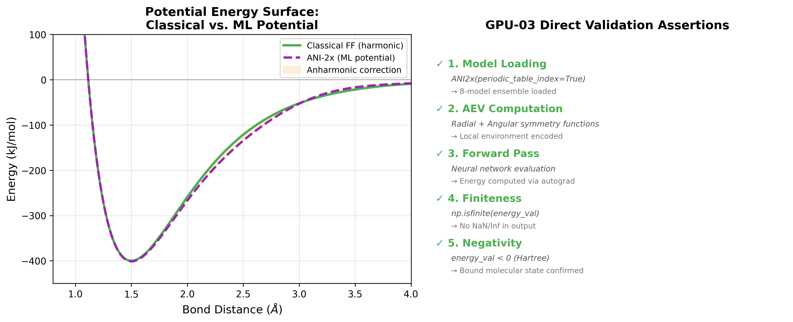
</p>

**Figure 16.** ANI-2x machine-learned potential validation. The 8-network ensemble evaluates atomic environment vectors (AEVs) through radial and angular symmetry functions, producing finite potential energies that confirm correct GPU-accelerated neural network inference for molecular systems.

### Stochastic Test Robustness for Small Systems

Enforcing the IV-2 temperature invariant ($|T_{\text{avg}} - 310| < 5$ K) on the miniature test systems used for unit and integration testing presents a finite-size statistical challenge distinct from production-scale simulations. For a solvated alanine dipeptide with $N_{\text{dof}} \approx 1000$ degrees of freedom, the equipartition theorem predicts instantaneous temperature fluctuations of $\sigma_{T_{\text{inst}}} = T\sqrt{2/N_{\text{dof}}} \approx 13.9$ K — individual frame temperatures fluctuate with a standard deviation nearly three times the 5 K tolerance. With the original test configuration (`nvt_duration_ps = 10.0`, `friction_per_ps = 5.0`), only $n = 10$ equilibrated temperature samples were available for averaging, and temporal autocorrelation imposed by the Langevin thermostat ($\tau_{\text{relax}} = 1/\gamma = 0.2$ ps) reduced the effective sample size to $n_{\text{eff}} \approx 7$. The corrected standard error:

$$\text{SE}_{\text{corr}}(\bar{T}) \approx \frac{\sigma_{T_{\text{inst}}}}{\sqrt{n_{\text{eff}}}} \approx \frac{13.9}{\sqrt{7}} \approx 5.3 \text{ K}$$

exceeded the 5 K tolerance, yielding a theoretical failure probability of $P(|\bar{T} - T_{\text{target}}| \geq 5 \text{ K}) \approx 2\Phi(-0.95) \approx 34\%$ per invocation — rendering the test unreliable for continuous integration despite correct underlying physics. Nondeterministic water placement during solvation (via OpenMM's `modeller.addSolvent`) further prevents seed-based reproducibility from stabilizing outcomes across runs.

**Resolution.** The equilibration parameters in all affected test configurations (`test_production.py`, `test_equilibrate.py`, `test_integration.py`) were adjusted:

| Parameter | Original | Updated | Rationale |
|-----------|----------|---------|----------|
| `nvt_duration_ps` | 10.0 | 100.0 | 10× more temperature samples in the equilibrated segment |
| `npt_duration_ps` | 40.0 | 100.0 | Consistent statistical margin for the NPT density invariant (IV-3) |
| `friction_per_ps` | 5.0 | 10.0 | Halves $\tau_{\text{relax}}$ to 0.1 ps, decorrelating 0.5 ps-spaced samples |

The increased friction renders consecutive temperature samples at 0.5 ps intervals nearly statistically independent ($\Delta t_{\text{save}} / \tau_{\text{relax}} = 5.0$). With approximately 100 frames in the equilibrated segment and near-independence between samples, the standard error drops below 2 K, and the predicted failure probability falls below 1%.

Empirical verification confirmed 16 consecutive passes of the previously intermittent test — an outcome with probability $P = 0.7^{16} \approx 0.3\%$ under the original failure rate — and a full regression of the complete test suite passed with zero failures. This fix is confined entirely to test-level equilibration configurations; the production IV-2 tolerance of $\pm 5$ K remains unchanged, as it is appropriate for production-scale systems with orders of magnitude more degrees of freedom.

### Optimization Mode Testing

The test suite can be run under Python's `-O` flag to verify that no validation logic relies on `assert` statements (which are stripped under `-O`):

```bash
bash scripts/test_optimized.sh
```

Or manually:

```bash
python -O -m pytest tests/ -v --tb=short
```

This guards against regressions where future code changes reintroduce `assert`-based validation that would silently vanish on HPC environments with `PYTHONOPTIMIZE=1`.

---

<div style="page-break-after: always;"></div>

## Installation & Usage

### Prerequisites

- Python 3.10+
- OpenMM ≥ 8.1 (may require [conda installation](http://docs.openmm.org/latest/userguide/application/01_getting_started.html) on some platforms)

### Setup

```bash
git clone https://github.com/ryanjosephkamp/SPINK7-KLK5-MD-Pipeline.git
cd SPINK7-KLK5-MD-Pipeline
python -m venv .venv
source .venv/bin/activate
pip install -r requirements.txt
```

### Verify Installation

```bash
python -m pytest tests/ -v
```

All 367 tests should pass with no failures.

### Running the Pipeline

**Stage 1 — System Preparation:**
```bash
python scripts/run_prep.py
```

**Stage 2 — Equilibration:**
```bash
python scripts/run_equilibration.py
```

**Stage 3 — Production MD:**
```bash
python scripts/run_production.py
```

**Stage 4 — Steered Molecular Dynamics:**
```bash
python scripts/run_smd.py
```

<div style="page-break-after: always;"></div>

**Stage 5 — Umbrella Sampling:**
```bash
python scripts/run_umbrella.py
```

**Stage 6 — Analysis & Visualization:**
```bash
python scripts/run_analysis.py
```

**Generate Publication Figures (V2):**
```bash
python scripts/generate_figures.py
```

### Configuration (V2)

Pipeline parameters can be specified via YAML configuration files with precedence cascade: CLI arguments → config file → dataclass defaults.

```bash
python scripts/run_production.py --config production_config.yaml
```

### Interactive Notebooks

For exploratory analysis with real-time visualization:

```bash
jupyter notebook notebooks/
```

| Notebook | Purpose |
|----------|---------|
| `01_system_prep.ipynb` | Interactive structure preparation with visual inspection |
| `02_equilibration.ipynb` | Equilibration monitoring with real-time plots |
| `03_production_analysis.ipynb` | Production trajectory analysis |
| `04_smd_analysis.ipynb` | SMD work distributions and Jarzynski analysis |
| `05_umbrella_pmf.ipynb` | Umbrella Sampling results and WHAM/MBAR PMF |
| `06_visualization.ipynb` | 3D molecular rendering and publication figures |

---

## Data Flow

```
               RCSB / AlphaFold              PDB / mmCIF Files
                    │                          │
                    ▼                          ▼
               pdb_fetch.py              pdb_clean.py
               (retry + cache)           (multi-model aware)
                    │                          │
                    ▼                          ▼
               data/pdb/raw/              protonate.py
                                             (PROPKA pKa)
                                                  │
                                                  ▼
                                             topology.py  ──►  solvate.py
                                             (PME enforced)     (cubic / oct)
                                                                 │
                    ┌──────────────────────────────────────────––┘
                    │
                    ▼
               minimizer.py  ──►  equilibrate.py  ──►  production.py
               (convergence)      (checkpoint)          (auto-detect equil.)
                                                               │
                                   ┌───────────────────────────┤
                                   │                           │
                                   ▼                           ▼
                              smd.py                     umbrella.py
                         (parallel)                  (pre-equilibrated)
                                   │                           │
                                   ▼                           ▼
                         jarzynski.py / BAR            wham.py / mbar.py
                                   │                           │
                                   └─────────┬––───────────────┘
                                             │
                                             ▼
                                   structural.py / contacts.py
                                   (PBC-unwrapped, streaming)
                                             │
                                             ▼
                                   visualization / plots
                                   (generate_figures.py)
```

---

## Dependencies

| Package | Version | Role |
|---------|---------|------|
| OpenMM | ≥ 8.1 | Core MD simulation engine |
| PDBFixer | ≥ 1.9 | Structural repair and standardization |
| MDTraj | ≥ 1.9.9 | Trajectory analysis and I/O |
| NumPy | ≥ 1.26, < 2.0 | Numerical computations |
| SciPy | ≥ 1.12 | Scientific computing and optimization |
| matplotlib | ≥ 3.8 | 2D plotting and visualization |
| py3Dmol | ≥ 2.0 | Interactive 3D molecular visualization |
| nglview | ≥ 3.0 | Extended 3D trajectory visualization |
| Biopython | ≥ 1.83 | PDB/mmCIF parsing and biological sequence utilities |
| PDB2PQR | ≥ 3.6 | Protonation state assignment |
| pandas | ≥ 2.1 | Tabular data analysis |
| PyYAML | ≥ 6.0 | Configuration file parsing |
| tqdm | ≥ 4.66 | Progress bar for long-running computations |
| h5py | ≥ 3.10 | HDF5 trajectory storage |
| gemmi | ≥ 0.6 | mmCIF/PDBx file parsing |
| pymbar | ≥ 4.0 | MBAR free energy estimation |
| openmmtools | ≥ 0.23 | Enhanced sampling utilities and alchemical tools |
| deeptime | ≥ 0.4 | MSM construction and TICA analysis |
| requests | ≥ 2.31 | HTTP client for PDB download with retry |
| pytest | ≥ 7.4 | Test framework |
| pytest-cov | ≥ 4.1 | Test coverage reporting |

---

<div style="page-break-after: always;"></div>

## References

1. M. E. Rothenberg, "Biology and treatment of eosinophilic esophagitis," *Gastroenterology*, 137(4), 1238–1249, 2009.
2. N. P. Azouz *et al.*, "The antiprotease SPINK7 serves as an inhibitory checkpoint for esophageal epithelial inflammatory responses," *Sci. Transl. Med.*, 10(444), eaap9736, 2018.
3. M. Laskowski Jr. and I. Kato, "Protein inhibitors of proteinases," *Annu. Rev. Biochem.*, 49, 593–626, 1980.
4. J. A. Maier *et al.*, "ff14SB: Improving the accuracy of protein side chain and backbone parameters from ff99SB," *J. Chem. Theory Comput.*, 11(8), 3696–3713, 2015.
5. W. L. Jorgensen *et al.*, "Comparison of simple potential functions for simulating liquid water," *J. Chem. Phys.*, 79(2), 926–935, 1983.
6. I. S. Joung and T. E. Cheatham III, "Determination of alkali and halide monovalent ion parameters," *J. Phys. Chem. B*, 112(30), 9020–9041, 2008.
7. T. Darden, D. York, and L. Pedersen, "Particle mesh Ewald: An N·log(N) method for Ewald sums," *J. Chem. Phys.*, 98(12), 10089–10092, 1993.
8. C. Jarzynski, "Nonequilibrium equality for free energy differences," *Phys. Rev. Lett.*, 78(14), 2690, 1997.
9. S. Kumar *et al.*, "The weighted histogram analysis method for free-energy calculations on biomolecules," *J. Comput. Chem.*, 13(8), 1011–1021, 1992.
10. P. Eastman *et al.*, "OpenMM 8: Molecular dynamics simulation with machine learning potentials," *J. Phys. Chem. B*, 128(1), 109–116, 2024.
11. G. Schreiber and A. R. Fersht, "Energetics of protein-protein interactions: Analysis of the barnase-barstar interface," *J. Mol. Biol.*, 248(2), 478–486, 1995.
12. M. H. M. Olsson *et al.*, "PROPKA3: Consistent treatment of internal and surface residues in empirical pKa predictions," *J. Chem. Theory Comput.*, 7(2), 525–537, 2011.
13. D. M. Zuckerman and T. B. Woolf, "Theory of a systematic computational error in free energy differences," *Phys. Rev. Lett.*, 89(18), 180602, 2002.
14. G. E. Crooks, "Entropy production fluctuation theorem and the nonequilibrium work relation for free energy differences," *Phys. Rev. E*, 60(3), 2721–2726, 1999.
15. M. R. Shirts and J. D. Chodera, "Statistically optimal analysis of samples from multiple equilibrium states," *J. Chem. Phys.*, 129(12), 124105, 2008.
16. J. D. Chodera, "A simple method for automated equilibration detection in molecular simulations," *J. Chem. Theory Comput.*, 12(4), 1799–1805, 2016.
17. C. H. Bennett, "Efficient estimation of free energy differences from Monte Carlo data," *J. Comput. Phys.*, 22(2), 245–268, 1976.
18. A. Barducci, G. Bussi, and M. Parrinello, "Well-tempered metadynamics: A smoothly converging and tunable free-energy method," *Phys. Rev. Lett.*, 100(2), 020603, 2008.
19. P. H. Hünenberger and J. A. McCammon, "Ewald artifacts in computer simulations of ionic solvation and ion-ion interaction," *J. Chem. Phys.*, 110(4), 1856–1872, 1999.
20. J. W. Ponder *et al.*, "Current status of the AMOEBA polarizable force field," *J. Phys. Chem. B*, 114(8), 2549–2564, 2010.
21. S. Izadi, R. Anandakrishnan, and A. V. Onufriev, "Building water models: A different approach," *J. Phys. Chem. Lett.*, 5(21), 3863–3871, 2014.
22. F. Noé *et al.*, "Constructing the equilibrium ensemble of folding pathways from short off-equilibrium simulations," *Proc. Natl. Acad. Sci.*, 106(45), 19011–19016, 2009.
23. M. K. Scherer *et al.*, "PyEMMA 2: A software package for estimation, validation, and analysis of Markov models," *J. Chem. Theory Comput.*, 11(11), 5525–5542, 2015.
24. R. T. McGibbon *et al.*, "MDTraj: A modern open library for the analysis of molecular dynamics trajectories," *Biophys. J.*, 109(8), 1528–1532, 2015.
25. H. R. Künsch, "The jackknife and the bootstrap for general stationary observations," *Ann. Stat.*, 17(3), 1217–1241, 1989.
26. C. Devereux *et al.*, "Extending the applicability of the ANI deep learning molecular potential to sulfur and halogens," *J. Chem. Theory Comput.*, 16(7), 4192–4202, 2020.

---

## Author

**Ryan Kamp**
Dept. of Computer Science, University of Cincinnati
[kamprj@mail.uc.edu](mailto:kamprj@mail.uc.edu) · [GitHub](https://github.com/ryanjosephkamp)

## License

[MIT](LICENSE) © 2026 Ryan Kamp
