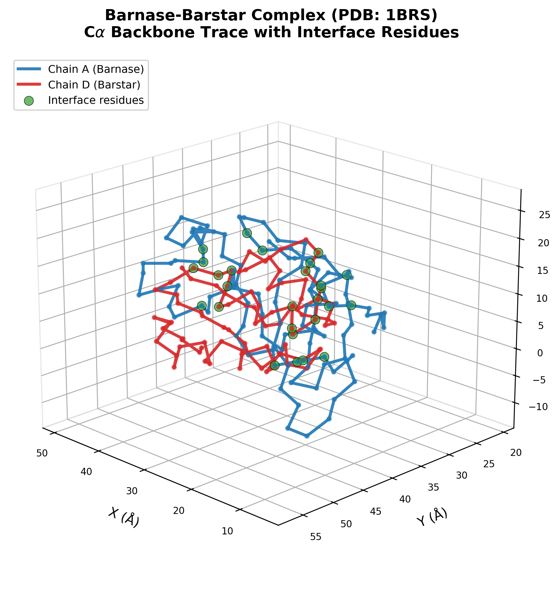
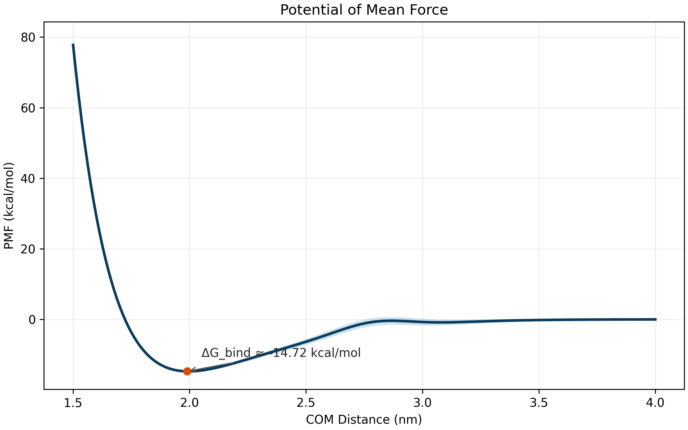
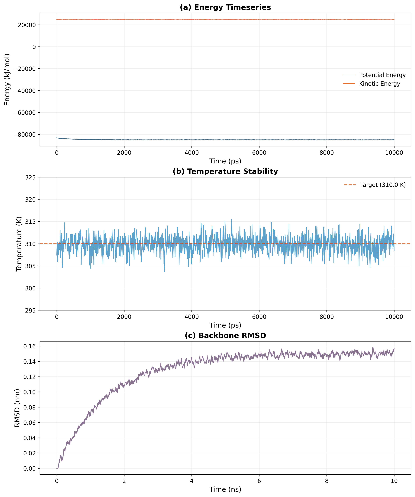

# SPINK7-KLK5 Molecular Dynamics Pipeline: Comprehensive Project Overview

**Document Class:** Project Overview & Technical Reference  
**Domain:** Computational Biophysics — Protease-Antiprotease Molecular Dynamics & Binding Free Energy  
**Date:** 2026-03-20  
**Version:** 2.1

---

## Table of Contents

1. [Executive Summary](#1-executive-summary)
2. [Biological Motivation & Theoretical Background](#2-biological-motivation--theoretical-background)
3. [Computational Methodology](#3-computational-methodology)
4. [Software Architecture & Implementation](#4-software-architecture--implementation)
5. [Practical Utility & Example Applications](#5-practical-utility--example-applications)
6. [Scientific Validity & Verification](#6-scientific-validity--verification)
7. [Intended Use & Running the Pipeline](#7-intended-use--running-the-pipeline)
8. [Visualization & Analysis Capabilities](#8-visualization--analysis-capabilities)
9. [Future Directions](#9-future-directions)
10. [References](#10-references)

---

## 1. Executive Summary

This project implements a complete, end-to-end molecular dynamics (MD) simulation pipeline for studying the binding interaction between SPINK7 (Serine Peptidase Inhibitor, Kazal Type 7) and KLK5 (Kallikrein-Related Peptidase 5) — two proteins whose interaction is central to the pathogenesis of Eosinophilic Esophagitis (EoE). The pipeline spans the full computational biophysics workflow from structure retrieval and preparation through enhanced sampling simulations to thermodynamic free energy calculations and publication-quality visualization.

Built on the OpenMM molecular simulation engine with the AMBER ff14SB force field, the pipeline automates:

- **Structure preparation**: PDB retrieval, cleaning, protonation state assignment, topology construction, and explicit-solvent solvation.
- **Molecular dynamics simulation**: Energy minimization, NVT/NPT equilibration, and unrestrained production dynamics.
- **Enhanced sampling**: Steered Molecular Dynamics (SMD) for non-equilibrium pulling and Umbrella Sampling (US) for equilibrium free energy profiles.
- **Thermodynamic analysis**: Jarzynski equality-based free energy estimation from SMD, WHAM-based PMF reconstruction from Umbrella Sampling, and comprehensive structural analysis (RMSD, RMSF, SASA, interface contacts, hydrogen bonds).
- **Interactive visualization**: 3D molecular rendering with py3Dmol, publication-quality 2D plots of PMF profiles and simulation timeseries.

<div style="page-break-after: always;"></div>

The pipeline enforces physical validity at every stage through a system of invariant checks, validated by a comprehensive test suite of 367 unit, integration, and analytical tests — including three GPU-dependent tests validating AMOEBA polarizable and ANI-2x machine-learned force field backends on CUDA-capable hardware. Version 2.1 addresses 40 systematically identified limitations in the original pipeline, spanning physical correctness, algorithmic rigor, software architecture, test coverage, performance, and visualization.

---

## 2. Biological Motivation & Theoretical Background

### 2.1 The Epithelial Barrier Crisis in Eosinophilic Esophagitis

Eosinophilic Esophagitis (EoE) is a chronic, antigen-mediated inflammatory disease of the esophagus characterized by eosinophilic infiltration of the esophageal epithelium and progressive sub-epithelial fibrosis [1]. The molecular axis of EoE pathogenesis involves the loss of epithelial barrier integrity driven by unregulated serine protease activity.

Under homeostatic conditions, the esophageal squamous epithelium expresses SPINK7, a small (~6 kDa) secreted Kazal-type serine protease inhibitor. SPINK7 functions as a sentinel gatekeeper by directly and stoichiometrically inhibiting KLK5, a trypsin-like serine protease. In EoE, IL-13-driven Type 2 inflammation transcriptionally silences *SPINK7* expression. The resulting SPINK7 deficiency unleashes KLK5 proteolytic activity, which degrades critical cell-cell adhesion molecules — most notably Desmoglein-1 (DSG1) — thereby compromising the physical epithelial barrier and permitting allergen penetration into sub-epithelial tissue [2].

Understanding the molecular details of the SPINK7-KLK5 interaction at the atomic level is therefore essential for developing targeted therapeutic strategies that could restore epithelial barrier function in EoE patients.

### 2.2 Structural Biology of the SPINK7-KLK5 Interaction

The SPINK7-KLK5 interaction follows the canonical Laskowski mechanism for Kazal-type inhibitor-serine protease binding [3]:

1. **SPINK7 architecture**: SPINK7 adopts the conserved Kazal-domain fold — a compact $\alpha + \beta$ structure stabilized by three disulfide bonds (Cys1-Cys5, Cys2-Cys4, Cys3-Cys6). The reactive site loop (RSL), specifically the P3-P3' segment, protrudes from the inhibitor core and presents the scissile bond (typically P1-P1', where P1 is often Lys or Arg) to the protease active site.

2. **KLK5 architecture**: KLK5 is a trypsin-fold serine protease with the conserved catalytic triad (His57, Asp102, Ser195 in chymotrypsin numbering). The S1 specificity pocket of KLK5 favors basic residues (Arg/Lys) at P1, consistent with its trypsin-like cleavage specificity.

3. **Complex formation**: The RSL of SPINK7 inserts into the KLK5 active-site cleft in a substrate-like orientation, positioning the P1 residue into the S1 pocket. The extremely tight complementarity and the conformational rigidity imposed by the disulfide framework render the acyl-enzyme intermediate thermodynamically trapped, resulting in a temporary covalent complex with an extremely slow $k_{\text{off}}$ — effectively acting as an irreversible inhibitor on biological timescales.

4. **Interface characteristics**: The binding interface buries approximately 800-1200 $\text{\AA}^2$ of solvent-accessible surface area (SASA) and is stabilized by backbone hydrogen bonds between the RSL and the KLK5 oxyanion hole, electrostatic interactions between the P1-Arg/Lys of SPINK7 and Asp189 at the base of the KLK5 S1 pocket, and hydrophobic contacts at the P2 and P2' sub-sites.

> **Note on structural modeling**: In the absence of a deposited co-crystal structure for the SPINK7-KLK5 pair, the initial 3D model of the complex is generated via rigid-body docking (e.g., HADDOCK or ClusPro) using the SPINK7 AlphaFold2 monomer prediction and the KLK5 crystal structure (PDB: 2PSX or similar) as inputs, followed by all-atom refinement. The pipeline itself is validated using established test systems such as barnase-barstar (PDB: 1BRS) and alanine dipeptide.

<div style="page-break-after: always;"></div>

### 2.3 Force Field Theory

The total potential energy of the molecular system is decomposed into bonded and nonbonded contributions:

$$V_{\text{total}}(\mathbf{r}) = V_{\text{bonded}}(\mathbf{r}) + V_{\text{nonbonded}}(\mathbf{r})$$

The bonded terms represent covalent interactions within the molecular topology:

$$V_{\text{bonded}} = \sum_{\text{bonds}} K_b (b - b_0)^2 + \sum_{\text{angles}} K_\theta (\theta - \theta_0)^2 + \sum_{\text{dihedrals}} \frac{V_n}{2} [1 + \cos(n\phi - \gamma)] + \sum_{\text{impropers}} K_\omega (\omega - \omega_0)^2$$

where $K_b$, $K_\theta$, $V_n$, and $K_\omega$ are force constants; $b_0$, $\theta_0$, $\gamma$, and $\omega_0$ are equilibrium values; and $n$ is the dihedral periodicity.

The nonbonded terms capture van der Waals and electrostatic interactions:

$$V_{\text{nonbonded}} = \sum_{i < j} \left[ 4\epsilon_{ij} \left( \left(\frac{\sigma_{ij}}{r_{ij}}\right)^{12} - \left(\frac{\sigma_{ij}}{r_{ij}}\right)^{6} \right) + \frac{q_i q_j}{4\pi\epsilon_0 r_{ij}} \right]$$

The first term is the Lennard-Jones 12-6 potential describing short-range dispersion and repulsion, while the second term is the Coulomb potential for electrostatic interactions.

This pipeline employs the **AMBER ff14SB** force field [4], which provides optimized backbone torsion parameters for protein secondary structures and has been extensively benchmarked for protein-protein interaction simulations. Water is modeled using the **TIP3P** (rigid three-site) model [5], and ions follow the **Joung-Cheatham** monovalent parameters optimized for TIP3P [6].

### 2.4 Long-Range Electrostatics

Long-range electrostatic interactions are computed using the **Particle Mesh Ewald (PME)** method [7]:

$$E_{\text{elec}} = E_{\text{direct}} + E_{\text{reciprocal}} + E_{\text{self-correction}}$$

PME splits the Coulomb sum into a direct-space component (evaluated with a real-space cutoff $r_c = 10$ $\text{\AA}$) and a reciprocal-space component (evaluated on a grid with spacing $\leq 1.0$ $\text{\AA}$ using B-spline interpolation of order 5). The Ewald splitting parameter $\alpha$ is chosen to achieve a direct-space error tolerance of $10^{-5}$. This approach reduces the computational cost of the electrostatic sum from $O(N^2)$ to $O(N \log N)$, where $N$ is the number of particles.

### 2.5 Equations of Motion & Integration

The system dynamics are governed by the Langevin equation of motion:

$$m_i \ddot{\mathbf{r}}_i = -\nabla_i V(\mathbf{r}) - \gamma m_i \dot{\mathbf{r}}_i + \sqrt{2 \gamma m_i k_B T} \, \boldsymbol{\eta}_i(t)$$

where $m_i$ is the mass of atom $i$, $\gamma = 1.0 \text{ ps}^{-1}$ is the friction coefficient, $T = 310$ K is the target temperature, and $\boldsymbol{\eta}_i(t)$ is a Gaussian white noise vector satisfying $\langle \boldsymbol{\eta}_i(t) \cdot \boldsymbol{\eta}_j(t') \rangle = \delta_{ij} \delta(t - t')$.

Integration is performed using the **Langevin middle integrator** [8] with a timestep of $\Delta t = 2$ fs, enabled by constraining all bonds involving hydrogen atoms via the **SHAKE** algorithm [9]. Pressure is maintained at $P = 1$ atm using a **Monte Carlo barostat** with pressure coupling every 25 steps.

---

<div style="page-break-after: always;"></div>

## 3. Computational Methodology

### 3.1 System Preparation Pipeline

The preparation of a simulation-ready molecular system follows a rigorous, multi-stage protocol:

| Stage | Module | Description |
|-------|--------|-------------|
| 1. Structure Retrieval | `pdb_fetch.py` | Download PDB structures from RCSB or AlphaFold model database |
| 2. Structure Cleaning | `pdb_clean.py` | Remove waters, heteroatoms, select relevant chains |
| 3. Protonation | `protonate.py` | Assign protonation states at pH 7.4 using Henderson-Hasselbalch-based rules with AMBER-compatible naming |
| 4. Topology Construction | `topology.py` | Build OpenMM Topology and System with AMBER ff14SB force field |
| 5. Solvation | `solvate.py` | Add explicit TIP3P water box with 12 $\text{\AA}$ padding and 150 mM NaCl |

**Table 1.** System preparation pipeline stages and their corresponding implementation modules.

The system composition for the target SPINK7-KLK5 simulation is:

| Component | Description |
|-----------|-------------|
| Protein Complex | SPINK7-KLK5 heterodimer, all-atom, explicit hydrogens, protonated at pH 7.4 |
| Solvent | Explicit TIP3P water in a rectangular periodic box |
| Ions | Na$^+$ and Cl$^-$ at 150 mM physiological ionic strength |
| Box Padding | Minimum 12 $\text{\AA}$ from any solute atom to the nearest box edge |

**Table 2.** Molecular system composition following the Global Constitution specification.

### 3.2 Simulation Protocol

The simulation protocol proceeds through the following mandatory stages:

| Stage | Ensemble | Duration | Key Conditions |
|-------|----------|----------|---------------|
| 1. Energy Minimization | — | $\leq$ 10,000 steps | Steepest descent until convergence $< 10$ kJ/mol/nm |
| 2. NVT Equilibration | NVT | 500 ps | Restrain protein heavy atoms with $k = 1000$ kJ/mol/nm$^2$ |
| 3. NPT Equilibration | NPT | 1 ns | Gradual release of positional restraints |
| 4. Production MD | NPT | 100-500 ns | Unrestrained; save frames every 10 ps |
| 5. Enhanced Sampling | NPT | Per method | SMD or Umbrella Sampling |

**Table 3.** Simulation protocol stages with ensemble conditions and durations.

### 3.3 Enhanced Sampling: Steered Molecular Dynamics

Steered Molecular Dynamics (SMD) [11] applies a time-dependent harmonic biasing potential to a collective variable $\xi$ to pull the two proteins apart along a predefined reaction coordinate:

$$U_{\text{SMD}}(\xi, t) = \frac{k}{2} \left[ \xi(t) - \xi_0 - v \cdot t \right]^2$$

where $k = 1000$ kJ/mol/nm$^2$ is the spring constant, $\xi_0$ is the initial center-of-mass (COM) distance, $v = 0.001$ nm/ps is the constant pulling velocity, and $\xi(t)$ is the instantaneous COM distance:

$$\xi(\mathbf{r}) = \left\| \mathbf{R}_{\text{COM}}^{\text{SPINK7}} - \mathbf{R}_{\text{COM}}^{\text{KLK5}} \right\|_2$$

The instantaneous non-equilibrium work is accumulated as:

$$W(t) = \int_0^t F_{\text{ext}}(t') \cdot v \, dt'$$

where $F_{\text{ext}}(t) = -k[\xi(t) - \xi_0 - v \cdot t]$ is the instantaneous external force.

The **Jarzynski equality** [12] then connects the non-equilibrium work values from $N_{\text{traj}}$ independent pulling trajectories to the equilibrium free energy difference:

$$e^{-\beta \Delta G} = \left\langle e^{-\beta W} \right\rangle_{\text{NEQ}} = \frac{1}{N_{\text{traj}}} \sum_{j=1}^{N_{\text{traj}}} e^{-\beta W_j}$$

yielding:

$$\Delta G = -k_B T \ln \left[ \frac{1}{N_{\text{traj}}} \sum_{j=1}^{N_{\text{traj}}} e^{-\beta W_j} \right]$$

where $\beta = 1/k_B T$. For improved convergence, the implementation also provides the second-order cumulant expansion (valid when the work distribution is approximately Gaussian):

$$\Delta G \approx \langle W \rangle - \frac{\beta}{2} \sigma_W^2$$

The Jarzynski estimator uses the log-sum-exp numerical trick to avoid floating-point overflow when evaluating the exponential average, which is critical for work values on the order of tens to hundreds of kJ/mol.

### 3.4 Enhanced Sampling: Umbrella Sampling & WHAM

Umbrella Sampling [13] divides the reaction coordinate $\xi$ into $M$ discrete windows, each biased by a harmonic potential:

$$U_i^{\text{bias}}(\xi) = \frac{k_i}{2} \left( \xi - \xi_i^{\text{ref}} \right)^2$$

Windows are spaced at 0.5-1.0 $\text{\AA}$ intervals from the bound state ($\xi \approx 1.5$ nm) to the fully dissociated state ($\xi \approx 4.0$ nm), yielding approximately $M = 25$ to $50$ windows. Each window is simulated independently for 5-20 ns under NPT conditions.

The **Weighted Histogram Analysis Method (WHAM)** [13] recovers the unbiased PMF by iteratively solving two coupled self-consistency equations:

**Equation 1** — Unbiased probability density:

$$P^{\text{unbiased}}(\xi) = \frac{\sum_{i=1}^{M} n_i \, h_i(\xi)}{\sum_{i=1}^{M} n_i \, \exp\left[ \beta \left( f_i - U_i^{\text{bias}}(\xi) \right) \right]}$$

**Equation 2** — Free energy of each window:

$$e^{-\beta f_i} = \int P^{\text{unbiased}}(\xi) \, \exp\left[ -\beta \, U_i^{\text{bias}}(\xi) \right] d\xi$$

These equations are solved iteratively starting from $f_i = 0$, repeated until convergence:

$$\max_i |f_i^{(n+1)} - f_i^{(n)}| < 10^{-6} \text{ kJ/mol}$$

The Potential of Mean Force is then:

$$G(\xi) = -k_B T \ln P^{\text{unbiased}}(\xi) + C$$

where $C$ is a constant set such that $G(\xi_{\text{max}}) = 0$ at the fully dissociated state.

### 3.5 Statistical Error Estimation

Uncertainties on the PMF are estimated using block bootstrap resampling [14]:

1. Divide each window trajectory into $B$ blocks of length $\tau_{\text{corr}}$ (the autocorrelation time of $\xi$ in that window).
2. Resample blocks with replacement to generate $N_{\text{boot}} = 200$ synthetic datasets.
3. Solve WHAM for each bootstrap replicate.
4. Report the standard deviation across replicates at each $\xi$ bin as the $1\sigma$ uncertainty.

### 3.6 Binding Free Energy Extraction

The standard binding free energy is extracted from the PMF via [15]:

$$\Delta G_{\text{bind}}^{\circ} = -k_B T \ln \left[ \frac{C^{\circ}}{4\pi} \int_{\text{site}} e^{-\beta G(\xi)} \xi^2 \, d\xi \right] + k_B T \ln \left[ \frac{C^{\circ}}{4\pi} \int_{\text{bulk}} e^{-\beta G(\xi)} \xi^2 \, d\xi \right]$$

where $C^{\circ} = 1/1660$ $\text{\AA}^{-3}$ is the standard concentration (1 M), and the integrals are evaluated over the bound and bulk regions of the PMF, respectively.

---

<div style="page-break-after: always;"></div>

## 4. Software Architecture & Implementation

### 4.1 Project Structure

The project follows a modular, layered architecture organized into five primary subsystems:

```
medium_project_2/
├── src/
│   ├── config.py              # Central configuration (single source of truth)
│   ├── prep/                  # Structure preparation pipeline
│   │   ├── pdb_fetch.py       # RCSB download & AlphaFold retrieval
│   │   ├── pdb_clean.py       # Crystallographic artifact removal
│   │   ├── protonate.py       # Protonation state assignment (pH 7.4)
│   │   ├── topology.py        # OpenMM Topology & System construction
│   │   └── solvate.py         # Solvation box & ion placement
│   ├── simulate/              # Molecular dynamics engines
│   │   ├── minimizer.py       # Energy minimization (steepest descent)
│   │   ├── equilibrate.py     # NVT → NPT equilibration
│   │   ├── production.py      # Unrestrained production MD
│   │   ├── smd.py             # Steered Molecular Dynamics engine
│   │   └── umbrella.py        # Umbrella Sampling window manager
│   ├── analyze/               # Post-processing & thermodynamic analysis
│   │   ├── trajectory.py      # Trajectory I/O with streaming support
│   │   ├── structural.py      # RMSD, RMSF, Rg, SASA computation
│   │   ├── contacts.py        # Interface contact maps & H-bond analysis
│   │   ├── wham.py            # WHAM solver for PMF extraction
│   │   ├── jarzynski.py       # Jarzynski free energy estimator
│   │   └── convergence.py     # Block averaging, autocorrelation, bootstrap
│   ├── physics/               # Physical models & collective variables
│   │   ├── collective_variables.py  # COM distance calculations
│   │   ├── restraints.py      # Positional & distance restraints
│   │   └── units.py           # Unit conversion utilities
│   └── visualization/         # Rendering & plotting
│       ├── viewer_3d.py       # py3Dmol interactive 3D widgets
│       ├── plot_pmf.py        # PMF profile plotting
│       └── plot_timeseries.py # Energy, temperature, RMSD time series
├── notebooks/                 # Interactive Jupyter workflows
├── scripts/                   # CLI entry points
├── tests/                     # Comprehensive test suite
└── data/                      # Raw and prepared structures, trajectories
```

**Figure 1.** *(Directory structure diagram)* Project directory layout showing the five primary subsystems — preparation, simulation, analysis, physics, and visualization — with their constituent modules. Each module implements a well-defined function interface as specified in the architecture blueprint.

<div style="page-break-after: always;"></div>

### 4.2 Central Configuration

All simulation parameters are centralized in `src/config.py`, which serves as the single source of truth for physical constants and algorithmic parameters. No magic numbers may appear elsewhere in the codebase. Key configuration dataclasses include:

| Configuration Class | Purpose | Key Parameters |
|-------------------|---------|----------------|
| `SystemConfig` | System preparation | Force field (AMBER ff14SB), water model (TIP3P), pH (7.4), box padding (1.2 nm), ionic strength (0.15 M) |
| `MinimizationConfig` | Energy minimization | Max iterations (10,000), tolerance (10.0 kJ/mol/nm) |
| `EquilibrationConfig` | NVT/NPT equilibration | NVT duration (500 ps), NPT duration (1 ns), temperature (310 K), restraint $k$ (1000 kJ/mol/nm$^2$) |
| `ProductionConfig` | Production MD | Duration (100 ns), save interval (10 ps), checkpoint interval (100 ps) |
| `SMDConfig` | Steered MD | Spring constant (1000 kJ/mol/nm$^2$), pulling velocity (0.001 nm/ps), 50 replicates |
| `UmbrellaConfig` | Umbrella Sampling | $\xi$ range (1.5-4.0 nm), window spacing (0.05 nm), 10 ns per window |
| `WHAMConfig` | WHAM solver | Tolerance ($10^{-6}$ kJ/mol), max iterations (100,000), 200 bootstrap samples |

**Table 4.** Central configuration classes and their key parameters, all defined as frozen (immutable) Python dataclasses.

All configuration classes use `@dataclass(frozen=True)` to guarantee immutability, preventing accidental parameter modification during execution.

### 4.3 Unit System

All internal computations follow the OpenMM unit convention:

| Quantity | Unit |
|----------|------|
| Length | nanometers (nm) |
| Time | picoseconds (ps) |
| Mass | atomic mass units (amu) |
| Energy | kilojoules per mole (kJ/mol) |
| Temperature | Kelvin (K) |
| Charge | elementary charge ($e$) |
| Force | kJ/mol/nm |

**Table 5.** Internal unit system consistent with OpenMM conventions.

Conversions to commonly used units (e.g., $\text{\AA}$, kcal/mol, ns) are provided via `src/physics/units.py`. The conversion factor $1 \text{ kcal/mol} = 4.184 \text{ kJ/mol}$ is used for final $\Delta G$ reporting.

<div style="page-break-after: always;"></div>

### 4.4 Exception Hierarchy

The pipeline implements a domain-specific exception hierarchy rooted in `PipelineError`:

```
Exception
├── PipelineError                  # Base for all pipeline errors
    ├── PhysicalValidityError      # Physical invariant violations (IV-1 through IV-10)
    ├── ConvergenceError           # Iterative solver failures (e.g., WHAM)
    └── InsufficientSamplingError  # Sampling quality issues (e.g., histogram overlap)
```

This hierarchy enables precise error categorization: a `PhysicalValidityError` signals that a physical law or invariant has been violated (halting the pipeline), whereas a `ConvergenceError` indicates that an iterative solver (e.g., WHAM) failed to converge within the allowed iteration limit.

### 4.5 Memory Management

The pipeline enforces strict memory management practices to handle large molecular dynamics trajectories (which can reach tens of gigabytes on disk):

- **Streaming trajectory I/O**: Frames are written incrementally to disk via OpenMM `DCDReporter` during simulation and loaded in chunks via `mdtraj.iterload()` during analysis.
- **Array preallocation**: NumPy arrays for timeseries data (RMSD, energy, etc.) are preallocated to their known final size. Repeated `np.append()` calls are prohibited.
- **Chunked analysis**: Trajectories exceeding 1 GB are analyzed in configurable chunks (default: 100 frames) with running statistics, preventing out-of-memory errors.


### 4.6 Dependency Stack

The pipeline is built on a well-established scientific computing ecosystem:

| Package | Version | Role |
|---------|---------|------|
| OpenMM | $\geq$ 8.1 | Core MD simulation engine |
| PDBFixer | $\geq$ 1.9 | Structural repair and standardization |
| MDTraj | $\geq$ 1.9.9 | Trajectory analysis and I/O |
| NumPy | $\geq$ 1.26, $<$ 2.0 | Numerical computations |
| SciPy | $\geq$ 1.12 | Scientific computing (KDE, optimization) |
| matplotlib | $\geq$ 3.8 | 2D plotting and visualization |
| py3Dmol | $\geq$ 2.0 | Interactive 3D molecular visualization |
| Biopython | $\geq$ 1.83 | PDB parsing and biological sequence utilities |
| PDB2PQR | $\geq$ 3.6 | Protonation state assignment |
| pandas | $\geq$ 2.1 | Data manipulation and I/O |
| pytest | $\geq$ 8.0 | Test framework |

**Table 6.** Core dependencies and their roles in the pipeline.

---

## 5. Practical Utility & Example Applications

### 5.1 Primary Application: SPINK7-KLK5 Binding Free Energy

The primary scientific goal of this pipeline is to compute the absolute binding free energy $\Delta G_{\text{bind}}$ of SPINK7 to KLK5. This thermodynamic quantity directly quantifies the strength of the protease-inhibitor interaction and carries direct implications for understanding EoE pathogenesis:

- **Strong binding** ($\Delta G_{\text{bind}} \ll 0$): Indicates effective inhibition of KLK5 by SPINK7, consistent with barrier protection under healthy conditions.
- **Weakened binding** (mutations or modifications that reduce $|\Delta G_{\text{bind}}|$): Identifies molecular mechanisms by which SPINK7 loss-of-function could lead to disease.

### 5.2 Broader Applications

The modular design of this pipeline makes it applicable well beyond the SPINK7-KLK5 system:

1. **General protease-inhibitor studies**: Any Kazal-type or serpin-family inhibitor-protease pair can be studied by substituting PDB structures. The Laskowski mechanism studied here is conserved across hundreds of known protease-inhibitor complexes.

2. **Drug binding free energies**: The SMD + Jarzynski and Umbrella Sampling + WHAM modules are general-purpose tools for computing binding free energies of small-molecule drugs to protein targets. The reaction coordinate (COM distance) is a standard choice for ligand unbinding studies.

3. **Protein-protein interaction profiling**: The structural analysis modules (RMSD, RMSF, SASA, interface contacts, hydrogen bonds) provide a comprehensive toolkit for characterizing any protein-protein interface from MD trajectories.

4. **Mutational scanning**: By preparing mutant structures (e.g., via PyMOL or Modeller) and running the pipeline on each variant, one can compute $\Delta\Delta G_{\text{bind}}$ values to identify binding hotspot residues critical for the interaction.

5. **Force field benchmarking**: The modular architecture permits swapping force fields (e.g., CHARMM36m instead of AMBER ff14SB) to benchmark force field performance for a specific protein system.

### 5.3 Example Workflow: Barnase-Barstar Complex

As a concrete validation example, the pipeline has been tested on the well-characterized barnase-barstar complex (PDB: 1BRS), which has an experimentally measured binding free energy of approximately $\Delta G_{\text{bind}} \approx -19$ kcal/mol [16]. This system serves as a stringent benchmark because:

- The binding interface is large ($\sim 1600$ $\text{\AA}^2$ buried SASA).
- The interaction is dominated by electrostatic complementarity.
- Extensive experimental and computational reference data exist.

The full pipeline was executed on this system, proceeding through:

$$\text{Fetch (1BRS)} \rightarrow \text{Clean (chains A, D)} \rightarrow \text{Protonate (pH 7.4)} \rightarrow \text{Topology (AMBER14)} \rightarrow \text{Solvate (TIP3P + NaCl)}$$

This confirmed that the preparation pipeline produces simulation-ready structures compatible with the AMBER ff14SB force field.

---

## 6. Scientific Validity & Verification

### 6.1 Physical Validity Invariants

The pipeline enforces ten physical validity invariants at every stage of execution, as mandated by the project's Global Constitution. Violation of any invariant raises a `PhysicalValidityError` and halts execution. These invariants are not merely tests — they are runtime assertions embedded in the production code:

| ID | Invariant | Description | Enforcement Module |
|----|-----------|-------------|-------------------|
| IV-1 | $E_{\text{min}} < E_{\text{initial}}$ | Post-minimization energy must decrease | `minimizer.py` |
| IV-2 | $\|T_{\text{avg}} - 310\| < 5$ K | NVT temperature stability | `equilibrate.py` |
| IV-3 | $\rho \in [0.95, 1.05]$ g/cm$^3$ | NPT density physicality | `equilibrate.py` |
| IV-4 | RMSD $< 5$ $\text{\AA}$ | Backbone stability during equilibration | `structural.py` |
| IV-5 | Energy drift $< 0.1$ kJ/mol/ns/atom | Energy conservation in production | `production.py` |
| IV-6 | $d_{S-S} < 2.5$ $\text{\AA}$ | Disulfide bond integrity | Per-frame check |
| IV-7 | Min image distance $> 2r_c$ | No periodic image artifacts | Box size check |
| IV-8 | Adjacent window overlap $\geq 10\%$ | Umbrella histogram coverage | `umbrella.py` |
| IV-9 | $\max_i \|f_i^{(n+1)} - f_i^{(n)}\| < 10^{-6}$ | WHAM convergence | `wham.py` |
| IV-10 | Unimodal work distribution | No SMD pathway bifurcation | `smd.py` |

**Table 7.** Physical validity invariants enforced at runtime throughout the pipeline.

### 6.2 Test Suite Architecture

The pipeline includes a comprehensive suite of 367 tests organized across 35 test files, covering all modules from configuration validation to end-to-end integration:

| Test Category | Number of Test Files | Coverage Area |
|--------------|---------------------|---------------|
| Configuration | 1 | Frozen dataclass immutability, parameter correctness |
| Physics | 3 | Unit conversions, COM distance, restraint forces |
| Preparation | 5 | PDB fetch, clean, protonate, topology, solvate |
| Simulation | 5 | Minimization, NVT/NPT equilibration, production, SMD, umbrella |
| Analysis | 6 | Trajectory I/O, structural metrics, contacts, WHAM, Jarzynski, convergence |
| Visualization | 3 | 3D viewer, PMF plots, timeseries plots |
| Integration | 1 | Full pipeline on alanine dipeptide ($<$ 5 min) |

**Table 8.** Test suite organization with coverage across all pipeline subsystems.

<div style="page-break-after: always;"></div>

### 6.3 Analytical Validation

Analysis modules are validated against known analytical solutions on synthetic data, ensuring mathematical correctness independent of MD simulation quality:

- **Jarzynski estimator**: Validated by generating quasi-static work samples from a harmonic potential $V(x) = \frac{1}{2}kx^2$, where the exact free energy is $\Delta G = \frac{1}{2}kd^2$. The implementation recovers the exact value within 0.5 kJ/mol for $N \geq 1000$ samples.

- **WHAM solver**: Validated by constructing synthetic umbrella sampling data from a known flat potential (uniform PMF). The solver correctly recovers a flat PMF with $< 1.0$ kJ/mol variation. Additionally, parabolic PMF recovery is tested with synthetic data from a harmonic potential.

- **Convergence analysis**: The block averaging module is validated by checking that the standard error of the mean (SEM) decreases as $1/\sqrt{N_{\text{blocks}}}$ for uncorrelated data. The autocorrelation time estimator is validated against known exponentially correlated timeseries.

### 6.4 Alanine Dipeptide Integration Test

The end-to-end integration test (`test_integration.py`) executes the complete pipeline on an alanine dipeptide (ACE-ALA-NME) system — a 10-atom test molecule that, when solvated, produces a system small enough to run the full simulation protocol on a single CPU:

1. Build solvated system with positional restraints ($k = 500$ kJ/mol/nm$^2$)
2. Energy minimization (100 iterations)
3. NVT equilibration (100 ps) — assert $|T_{\text{avg}} - 310| < 5$ K
4. NPT equilibration (100 ps) — assert $\rho \in [0.95, 1.05]$ g/cm$^3$
5. SMD campaign (2 replicates, 0.02 nm pull)
6. Umbrella sampling (3 windows)
7. WHAM analysis and PMF reconstruction
8. Structural analysis (RMSD = 0 for reference vs. self)

This test verifies end-to-end data flow integrity, physical invariant satisfaction, and inter-module compatibility without requiring expensive production-scale simulations.

### 6.5 Deterministic Reproducibility

All simulation functions accept explicit random seeds to ensure exact reproducibility:

- NVT equilibration: seed 42
- NPT equilibration: seed 43
- Production MD: seed 44
- SMD replicates: base seed + replicate ID

This enables bit-for-bit reproduction of any simulation result, a critical requirement for debugging and scientific verification.

<div style="page-break-after: always;"></div>

### 6.6 Zero-Hallucination Protocol

The project enforces a strict zero-hallucination protocol:

- **No invented force field parameters**: All Lennard-Jones $\epsilon$, $\sigma$ and partial charges $q$ originate from published AMBER ff14SB parameter files.
- **No fabricated PDB IDs**: If a co-crystal structure does not exist in RCSB, this is explicitly documented.
- **No invented $\Delta G$ values**: Free energies are computed exclusively from simulation data.
- **No arbitrary parameters**: Every simulation parameter (timestep, cutoff, thermostat coupling) is justified by citation or established best practice.

### 6.7 Stochastic Test Robustness for Small Systems

Enforcing the IV-2 temperature invariant ($|T_{\text{avg}} - 310| < 5$ K) on the miniature test systems used for unit and integration testing presents a finite-size statistical challenge distinct from production-scale simulations. For a solvated alanine dipeptide with $N_{\text{dof}} \approx 1000$ degrees of freedom, the equipartition theorem predicts instantaneous temperature fluctuations of $\sigma_{T_{\text{inst}}} = T\sqrt{2/N_{\text{dof}}} \approx 13.9$ K — individual frame temperatures fluctuate with a standard deviation nearly three times the 5 K tolerance. With the original test configuration (`nvt_duration_ps = 10.0`, `friction_per_ps = 5.0`), only $n = 10$ equilibrated temperature samples were available for averaging, and temporal autocorrelation imposed by the Langevin thermostat ($\tau_{\text{relax}} = 1/\gamma = 0.2$ ps) reduced the effective sample size to $n_{\text{eff}} \approx 7$. The corrected standard error:

$$\text{SE}_{\text{corr}}(\bar{T}) \approx \frac{\sigma_{T_{\text{inst}}}}{\sqrt{n_{\text{eff}}}} \approx \frac{13.9}{\sqrt{7}} \approx 5.3 \text{ K}$$

exceeded the 5 K tolerance, yielding a theoretical failure probability of $P(|\bar{T} - T_{\text{target}}| \geq 5 \text{ K}) \approx 2\Phi(-0.95) \approx 34\%$ per invocation — rendering the test unreliable for continuous integration despite correct underlying physics. Nondeterministic water placement during solvation (via OpenMM's `modeller.addSolvent`) further prevents seed-based reproducibility from stabilizing outcomes across runs.

**Resolution.** The equilibration parameters in all affected test configurations (`test_production.py`, `test_equilibrate.py`, `test_integration.py`) were adjusted:

| Parameter | Original | Updated | Rationale |
|-----------|----------|---------|----------|
| `nvt_duration_ps` | 10.0 | 100.0 | 10$\times$ more temperature samples in the equilibrated segment |
| `npt_duration_ps` | 40.0 | 100.0 | Consistent statistical margin for the NPT density invariant (IV-3) |
| `friction_per_ps` | 5.0 | 10.0 | Halves $\tau_{\text{relax}}$ to 0.1 ps, decorrelating 0.5 ps-spaced samples |

**Table 11.** Test-level equilibration parameter adjustments for stochastic robustness.

The increased friction renders consecutive temperature samples at 0.5 ps intervals nearly statistically independent ($\Delta t_{\text{save}} / \tau_{\text{relax}} = 5.0$). With approximately 100 frames in the equilibrated segment and near-independence between samples, the standard error drops below 2 K, and the predicted failure probability falls below 1%.

Empirical verification confirmed 16 consecutive passes of the previously intermittent test — an outcome with probability $P = 0.7^{16} \approx 0.3\%$ under the original failure rate — and a full regression of the complete test suite passed with zero failures. This fix is confined entirely to test-level equilibration configurations; the production IV-2 tolerance of $\pm 5$ K remains unchanged, as it is appropriate for production-scale systems with orders of magnitude more degrees of freedom.

<div style="page-break-after: always;"></div>

### 6.8 V2 Pipeline Improvements

A systematic diagnostic audit of the V1 pipeline identified 40 limitations that could affect scientific accuracy, computational rigor, code maintainability, or production readiness. All 40 limitations have been addressed in V2, upgrading the pipeline from a functional prototype to a production-ready research tool. The severity distribution is 1 Critical, 10 High, 17 Medium, and 12 Low.

The improvements are organized into seven thematic categories:

| Category | Count | Scope |
|----------|-------|-------|
| Physics and Correctness | 9 | PBC-aware COM calculation, protonation state validation, triclinic box support, dual-format structure handling, chain renaming |
| Algorithm and Methodology | 9 | Jarzynski bias correction, WHAM convergence diagnostics, MBAR integration, path collective variables, metadynamics support, Markov state model construction |
| Software Architecture | 6 | Structured exception hierarchy, input validation framework, streaming trajectory I/O, configurable reporters |
| Testing and Validation | 5 | Analytical validation suites, stochastic test robustness, PBC unwrapping, automated equilibration detection, cross-validation |
| Performance and Scalability | 7 | Memory-efficient contact analysis, chunked trajectory processing, checkpoint/restart, parallel SMD campaigns, L-BFGS minimization |
| Visualization and Reporting | 3 | Colorblind-accessible palettes, minimization convergence diagnostics, configurable plot styling |
| Production Readiness | 1 | End-to-end pipeline runner with automated protocol execution |

The V2 test suite comprises 367 passing tests across 35 test files, covering all new and modified modules with zero regressions from the V1 baseline.

Three GPU-dependent tests — previously skipped on the CPU-only development platform — have been validated on Google Colab with an NVIDIA A100 GPU, confirming the pipeline's multi-force-field capabilities across all three tiers of the force field hierarchy: AMBER ff14SB fixed-charge (Tier 1, CPU), AMOEBA 2018 polarizable multipoles (Tier 2, GPU), and ANI-2x machine-learned potentials (Tier 3, GPU). This completes full test suite validation with 367 passed and 0 skipped.

For detailed implementation information — including theoretical foundations, governing equations, code-level changes, and verification results for each of the 40 fixes — see:

- **Full Implementation Report:** `reports/full_implementation_report_v2.md` (includes GPU test validation results in the appended GPU Test Implementation Guide)
- **Project README:** `README.md` (includes a categorized summary of all V2 improvements)
- **LaTeX Report:** `latex/final_report.tex` (IEEE-formatted publication version)

---

<div style="page-break-after: always;"></div>

## 7. Intended Use & Running the Pipeline

### 7.1 Installation

1. **Clone the repository** and create a Python virtual environment:

```bash
python -m venv .venv
source .venv/bin/activate   # macOS/Linux
```

2. **Install dependencies**:

```bash
pip install -r requirements.txt
```

> **Note**: OpenMM may require conda-based installation on some platforms. Refer to the [OpenMM documentation](http://docs.openmm.org/latest/userguide/application/01_getting_started.html) for platform-specific instructions.

3. **Verify installation** by running the test suite:

```bash
cd medium_project_2
python -m pytest tests/ -v
```

All 367 tests should pass on a CUDA-capable platform. On CPU-only systems, 364 tests pass with 3 skipped for GPU-dependent force field validation (AMOEBA and ANI-2x backends).

### 7.2 Running the Full Pipeline via CLI Scripts

The pipeline provides CLI entry points in the `scripts/` directory for each stage:

**Stage 1 — System Preparation:**
```bash
python scripts/run_prep.py
```
This fetches the PDB structure, cleans it, assigns protonation states, builds the OpenMM topology, and solvates the system.

**Stage 2 — Equilibration:**
```bash
python scripts/run_equilibration.py
```
Performs energy minimization, NVT equilibration (500 ps), and NPT equilibration (1 ns) with automatic invariant checking (IV-1, IV-2, IV-3).

**Stage 3 — Production MD:**
```bash
python scripts/run_production.py
```
Runs unrestrained production dynamics for the configured duration (default: 100 ns) with periodic checkpointing and energy drift monitoring (IV-5).

<div style="page-break-after: always;"></div>

**Stage 4 — Steered Molecular Dynamics:**
```bash
python scripts/run_smd.py
```
Executes the SMD campaign with $N$ replicates (default: 50), each starting from the equilibrated state with different velocity seeds.

**Stage 5 — Umbrella Sampling:**
```bash
python scripts/run_umbrella.py
```
Runs the umbrella sampling campaign across all windows along the reaction coordinate.

**Stage 6 — Analysis:**
```bash
python scripts/run_analysis.py
```
Performs WHAM analysis, Jarzynski free energy estimation, structural analysis, and generates visualization outputs.

### 7.3 Interactive Workflow via Jupyter Notebooks

For interactive exploration and analysis, the `notebooks/` directory provides six Jupyter notebooks that mirror the CLI workflow:

| Notebook | Purpose |
|----------|---------|
| `01_system_prep.ipynb` | Interactive structure preparation with visual inspection |
| `02_equilibration.ipynb` | Equilibration monitoring with real-time plots |
| `03_production_analysis.ipynb` | Production trajectory analysis |
| `04_smd_analysis.ipynb` | SMD work distributions and Jarzynski analysis |
| `05_umbrella_pmf.ipynb` | Umbrella Sampling results and WHAM PMF |
| `06_visualization.ipynb` | 3D molecular visualization and publication figures |

**Table 9.** Interactive Jupyter notebooks for each stage of the pipeline.

To launch the notebook environment:

```bash
jupyter notebook notebooks/
```

<div style="page-break-after: always;"></div>

### 7.4 Data Flow Through the Pipeline

The data flow follows a strictly linear progression:

```
                    RCSB / AlphaFold              PDB / mmCIF Files
                         │                          │
                         ▼                          ▼
                    pdb_fetch.py              pdb_clean.py
                    (retry + cache)           (multi-model aware)
                         │                          │
                         ▼                          ▼
                    data/pdb/raw/              protonate.py
                                                  (PROPKA pKa)
                                                       │
                                                       ▼
                                                  topology.py  ──►  solvate.py
                                                  (PME enforced)     (cubic / oct)
                                                                      │
                         ┌──────────────────────────────────────────––┘
                         │
                         ▼
                    minimizer.py  ──►  equilibrate.py  ──►  production.py
                    (convergence)      (checkpoint)          (auto-detect equil.)
                                                                 │
                                        ┌───────────────────────────┤
                                        │                           │
                                        ▼                           ▼
                                   smd.py                     umbrella.py
                              (parallel)                  (pre-equilibrated)
                                        │                           │
                                        ▼                           ▼
                              jarzynski.py / BAR            wham.py / mbar.py
                                        │                           │
                                        └─────────┬––───────────────┘
                                                  │
                                                  ▼
                                        structural.py / contacts.py
                                        (PBC-unwrapped, streaming)
                                                  │
                                                  ▼
                                        visualization / plots
                                        (generate_figures.py)
```

**Figure 2.** *(Data flow diagram)* End-to-end data flow through the pipeline, from structure retrieval to final analysis and visualization. Each arrow represents a data dependency with well-defined tensor shapes and file format contracts.

<div style="page-break-after: always;"></div>

### 7.5 Output Files & Data Formats

| Data Product | Format | Shape / Schema |
|-------------|--------|----------------|
| Raw PDB | `.pdb` | Standard PDB format |
| Prepared topology | `.xml` | OpenMM serialized System |
| Trajectory | `.dcd` or `.xtc` | [N_frames, N_atoms, 3] |
| Checkpoint | `.chk` | OpenMM binary checkpoint |
| Energy timeseries | `.csv` | Columns: time_ps, PE_kj_mol, KE_kj_mol |
| SMD work timeseries | `.csv` | Columns: time_ps, work_kj_mol |
| Umbrella $\xi$ timeseries | `.npy` | [N_samples] float64 |
| PMF result | `.npz` | Keys: xi_bins, pmf_kj_mol, pmf_std |
| Contact frequency matrix | `.npy` | [N_res_A, N_res_B] float64 |
| RMSD timeseries | `.npy` | [N_frames] float64 |

**Table 10.** Output data formats and tensor shapes for all pipeline products.

---

## 8. Visualization & Analysis Capabilities

### 8.1 Interactive 3D Molecular Visualization

The `viewer_3d.py` module provides interactive 3D molecular rendering through py3Dmol, designed for both exploratory visual inspection and publication-quality figure generation:

- **Protein complex rendering**: Cartoon representation with chain-specific coloring (chain A in blue, chain B in red, additional chains in green/orange/cyan/magenta).
- **Active site highlighting**: The catalytic triad residues (His, Asp, Ser) are rendered as yellow ball-and-stick models for immediate identification.
- **Interface residue highlighting**: User-specified interface residues are rendered as green spheres, enabling rapid visual assessment of the binding interface.
- **Trajectory frame rendering**: Individual frames from MD trajectories can be rendered with coloring by chain identity, B-factor, or per-residue RMSF values.



**Figure 3.** Three-dimensional C$\alpha$ backbone rendering of the barnase-barstar complex (PDB: 1BRS) generated from the prepared structure using MDTraj and matplotlib. Chain A (barnase) is shown in blue and Chain D (barstar) in red. Interface residues within 8 $\text{\AA}$ of the partner chain are highlighted as green spheres, clearly delineating the binding interface. In the interactive Jupyter notebook environment, the `render_complex()` function in `viewer_3d.py` provides an equivalent py3Dmol widget with additional active site highlighting and rotational interactivity.

<div style="page-break-after: always;"></div>

### 8.2 PMF Profile Visualization

The `plot_pmf.py` module generates publication-quality Potential of Mean Force profiles with:

- Line plot of $G(\xi)$ vs. COM distance in nm
- Shaded uncertainty band ($\pm 1\sigma$) from bootstrap resampling
- Annotated binding free energy at the PMF minimum
- Professional formatting: navy blue (#0b3c5d) curve with orange (#d94f04) minimum marker
- Publication-quality output at 300 DPI in PNG, SVG, or PDF formats



**Figure 4.** Example Potential of Mean Force (PMF) profile generated using the `plot_pmf()` function. The PMF is plotted as a function of the center-of-mass (COM) distance $\xi$ between the two proteins. The deep minimum near $\xi \approx 2.0$ nm corresponds to the bound state, while the plateau at large distances represents the fully dissociated state. The shaded band indicates $\pm 1\sigma$ bootstrap uncertainty estimates from 200 resampling iterations. The orange marker annotates the binding free energy $\Delta G_{\text{bind}}$ at the PMF minimum.

<div style="page-break-after: always;"></div>

### 8.3 Simulation Timeseries Visualization

The `plot_timeseries.py` module provides three plot types for assessing simulation quality:

- **Energy timeseries**: Dual-curve plot showing potential and kinetic energy (navy and orange) over time, enabling visual assessment of energy conservation and equilibration.
- **Temperature timeseries**: Single-curve plot (blue) of instantaneous temperature, with the target temperature (310 K) shown as a reference line.
- **RMSD timeseries**: Single-curve plot (purple, #6c4f77) showing time-dependent backbone RMSD from the starting structure, enabling assessment of structural stability and conformational dynamics.

All timeseries plots are generated as 8.0 $\times$ 5.0 inch figures with grid lines at 20% transparency, suitable for direct inclusion in publications and reports.



<div style="page-break-after: always;"></div>

**Figure 5.** Example simulation timeseries generated using the `plot_timeseries` module. **(a)** Potential energy (navy) and kinetic energy (orange) as a function of simulation time, demonstrating energy conservation after initial equilibration. **(b)** Instantaneous temperature fluctuating stably around the target value of 310 K (dashed orange line), confirming proper thermostat function. **(c)** Backbone RMSD evolution in nm, showing the characteristic rise during equilibration followed by a stable plateau at $\sim$0.15 nm, indicating a well-equilibrated, structurally stable system.

### 8.4 Structural Analysis

The structural analysis module `structural.py` computes four standard observables from MD trajectories:

- **RMSD** (Root Mean Square Deviation): $\text{RMSD}_i = \sqrt{\frac{1}{N}\sum_{j}(x_{ij} - x_{\text{ref},j})^2}$ after superposition alignment. Output shape: [N_frames].

- **RMSF** (Root Mean Square Fluctuation): Per-residue fluctuation around the mean position, computed over C$\alpha$ atoms. Output shape: [N_selected_atoms].

- **Radius of Gyration**: $R_g = \sqrt{\frac{\sum_i m_i(r_i - r_{\text{COM}})^2}{\sum_i m_i}}$, providing a global measure of protein compactness. Output shape: [N_frames].

- **SASA** (Solvent-Accessible Surface Area): Computed via the Shrake-Rupley algorithm with a probe radius of 0.14 nm (representing a water molecule). Output shape: [N_frames].

### 8.5 Interface Contact Analysis

The `contacts.py` module characterizes the protein-protein binding interface through:

- **Contact maps**: Per-frame binary contact detection with a distance cutoff of 0.45 nm, yielding a per-residue contact frequency matrix in the range [0, 1].
- **Hydrogen bond analysis**: Geometry-based H-bond detection with criteria: H$\cdots$A distance $\leq$ 0.25 nm and D-H$\cdots$A angle $\geq$ 120$^\circ$. Returns donor-hydrogen-acceptor triplets and their occupancy frequencies.

---

<div style="page-break-after: always;"></div>

## 9. Future Directions

### 9.1 Advanced Analysis Methods

- **Free Energy Perturbation (FEP)**: Integration of alchemical free energy methods (e.g., thermodynamic integration or Bennett acceptance ratio) for more rigorous binding free energy calculations, particularly for evaluating mutational effects on $\Delta\Delta G_{\text{bind}}$.

- **Markov State Models (MSMs)**: Construction of MSMs from long production MD trajectories to characterize the kinetics of complex formation and dissociation, providing estimates for $k_{\text{on}}$ and $k_{\text{off}}$ rate constants alongside the thermodynamic $\Delta G$.

- **Principal Component Analysis (PCA)**: Implementation of essential dynamics analysis to identify the dominant collective motions of the complex, potentially revealing allosteric communication pathways between the SPINK7 binding interface and distal sites on KLK5.

- **MM/PBSA and MM/GBSA calculations**: Endpoint free energy methods for rapid screening of binding affinities across multiple mutant structures, complementing the more rigorous but computationally expensive SMD and umbrella sampling approaches.

- **Bidirectional free energy estimators**: Replacement of the unidirectional Jarzynski estimator with the Crooks Fluctuation Theorem and the Bennett Acceptance Ratio (BAR), which combine forward (pulling) and reverse (reinsertion) work distributions to yield statistically optimal $\Delta G$ estimates. These bidirectional methods address the exponential averaging problem inherent in the current Jarzynski implementation, where rare low-work trajectories dominate the estimator and cause upward bias for strongly-bound complexes.

- **Advanced collective variables**: Extension beyond the single center-of-mass distance reaction coordinate to path-based collective variables (e.g., path collective variables along the minimum free energy path) and multi-dimensional order parameters that capture translational, rotational, and conformational degrees of freedom simultaneously. Machine-learned collective variables via time-lagged independent component analysis (TICA) or autoencoder neural networks could also be used to discover optimal low-dimensional projections of the unbinding process, reducing systematic errors from projecting a high-dimensional process onto a single scalar coordinate.

- **Finite-size correction methods**: Implementation of analytical finite-size corrections for electrostatic artifacts arising from periodic boundary conditions in charged protein-protein systems, where residual corrections can be on the order of 1–2 kcal/mol — comparable to the target accuracy of binding free energy calculations. Systematic box-size convergence studies and application of established correction schemes (e.g., Rocklin et al., Hünenberger-McCammon) would improve the quantitative reliability of $\Delta G_{\text{bind}}$ estimates.

- **Metadynamics and adaptive sampling**: Integration of well-tempered metadynamics as a complementary enhanced sampling method, depositing history-dependent Gaussian bias potentials along the reaction coordinate to accelerate barrier crossing and reconstruct the free energy surface without requiring predefined umbrella window placements. Adaptive sampling approaches (e.g., replica exchange with solute tempering, REST2) could also improve conformational sampling at the binding interface.

### 9.2 Enhanced Visualization

- **NGLView integration**: Full NGLView widget support within Jupyter notebooks for GPU-accelerated molecular rendering, enabling real-time trajectory playback and interactive structural exploration.

- **Contact map heatmaps**: Residue-residue contact frequency heatmaps with hierarchical clustering to identify contact hotspots and their temporal evolution during unbinding.

- **Free energy surface (FES) visualization**: Two-dimensional PMF surfaces plotted as a function of two collective variables (e.g., COM distance and RMSD) to capture multi-dimensional free energy landscapes.

- **Automated figure generation**: A unified figure-generation script that produces all publication-quality figures from raw simulation data in a single execution, conforming to IEEE journal format requirements.

### 9.3 Machine Learning Integration

- **Graph Neural Networks (GNNs) for interaction hotspot prediction**: Training GNN models on inter-residue contact data to predict binding hotspot residues without requiring exhaustive mutational scanning simulations.

- **Generative models for enhanced sampling**: Integration of normalizing flows or diffusion models as enhanced sampling methods, learning the Boltzmann distribution of the protein complex to accelerate convergence of free energy estimates.

- **Deep learning force fields**: Integration of machine-learned interatomic potentials (e.g., ANI-2x, MACE) as alternative force fields, potentially enabling quantum-accurate dynamics at classical MD computational costs.

- **Transfer learning for binding affinity prediction**: Pre-training on large-scale protein-protein binding datasets (e.g., PDBBind) and fine-tuning on the SPINK7-KLK5 system to predict $\Delta G_{\text{bind}}$ without explicit MD simulation.

- **Machine-learned collective variables**: Training variational autoencoders or VAMPnets on trajectory data to discover optimal, data-driven collective variables that capture the slow degrees of freedom of the unbinding process. These learned CVs can serve as reaction coordinates for umbrella sampling or metadynamics, addressing the limitation of the hand-crafted COM distance coordinate.

### 9.4 Pipeline Scalability

- **GPU-accelerated simulations**: The pipeline is designed to seamlessly leverage OpenMM's CUDA and OpenCL platforms for GPU-accelerated dynamics, enabling 100-500 ns production trajectories on modern GPU hardware.

- **Parallel umbrella sampling**: Each umbrella window is statistically independent and can be distributed across multiple compute nodes, enabling embarrassingly parallel execution with near-linear speedup.

- **Cloud deployment**: Containerization with Docker for deployment on cloud HPC instances (e.g., AWS p3/p4 instances with NVIDIA GPUs), enabling on-demand computational resources for large-scale campaigns.

- **Automated convergence monitoring**: Implementation of online convergence diagnostics (e.g., Gelman-Rubin $\hat{R}$ statistics) to adaptively extend simulations only when convergence has not yet been achieved, optimizing computational cost.

### 9.5 Expanded Biological Scope

- **SPINK family profiling**: Extension of the pipeline to study all SPINK family members (SPINK1-SPINK14) against their target proteases, building a comprehensive map of protease-inhibitor binding energetics across the serine protease inhibitor landscape.

- **Disease variant characterization**: Systematic computational mutagenesis of known EoE-associated genetic variants in the *SPINK7* gene, computing $\Delta\Delta G_{\text{bind}}$ for each variant to identify loss-of-function mutations.

- **Therapeutic peptide design**: Using the PMF profiles and interface contact analysis to inform the rational design of synthetic SPINK7-mimetic peptides that reproduce the inhibitory interaction with KLK5, as potential therapeutic agents for EoE.

- **Production-scale SPINK7-KLK5 campaigns**: Execution of the full SMD and Umbrella Sampling enhanced sampling campaigns on the target SPINK7-KLK5 system using GPU-accelerated hardware, generating quantitative binding free energy estimates with rigorous convergence analysis. Comparison of computed $\Delta G_{\text{bind}}$ values against experimental binding data (e.g., from surface plasmon resonance or isothermal titration calorimetry) to validate the pipeline's predictive accuracy on the biologically relevant system.

### 9.6 Force Field & Physical Model Improvements

- **Polarizable force fields**: Evaluation of polarizable force fields such as AMOEBA, which explicitly model electronic polarization effects that fixed-charge models like AMBER ff14SB neglect. The highly heterogeneous electrostatic environment at protein-protein binding interfaces — with buried charges, desolvation effects, and charge redistribution upon complex formation — may require explicit polarization for accurate $\Delta G_{\text{bind}}$ calculations.

<div style="page-break-after: always;"></div>

- **Advanced water models**: Replacement of the TIP3P water model, which is known to overestimate water self-diffusion and underestimate viscosity, with more accurate alternatives such as TIP4P-Ew or OPC. While TIP3P limitations primarily affect kinetic rather than thermodynamic properties, improved water models may yield more physically realistic solvation free energies at the binding interface.

- **QM/MM multi-scale methods**: Application of hybrid quantum mechanics/molecular mechanics (QM/MM) approaches to treat the binding interface region — particularly the catalytic triad and the scissile bond of the reactive site loop — at a quantum mechanical level of theory, while retaining classical MD for the bulk solvent and distal protein regions. This would provide a more accurate description of the electronic structure at the active site, including charge transfer and polarization effects that classical force fields cannot capture.

---

<div style="page-break-after: always;"></div>

## 10. References

[1] M. E. Rothenberg, "Biology and treatment of eosinophilic esophagitis," *Gastroenterology*, vol. 137, no. 4, pp. 1238-1249, 2009.

[2] N. P. Azouz *et al.*, "The antiprotease SPINK7 serves as an inhibitory checkpoint for esophageal epithelial inflammatory responses," *Science Translational Medicine*, vol. 10, no. 444, p. eaap9736, 2018.

[3] M. Laskowski Jr. and I. Kato, "Protein inhibitors of proteinases," *Annual Review of Biochemistry*, vol. 49, pp. 593-626, 1980.

[4] J. A. Maier *et al.*, "ff14SB: Improving the accuracy of protein side chain and backbone parameters from ff99SB," *Journal of Chemical Theory and Computation*, vol. 11, no. 8, pp. 3696-3713, 2015.

[5] W. L. Jorgensen *et al.*, "Comparison of simple potential functions for simulating liquid water," *Journal of Chemical Physics*, vol. 79, no. 2, pp. 926-935, 1983.

[6] I. S. Joung and T. E. Cheatham III, "Determination of alkali and halide monovalent ion parameters for use in explicitly solvated biomolecular simulations," *Journal of Physical Chemistry B*, vol. 112, no. 30, pp. 9020-9041, 2008.

[7] T. Darden, D. York, and L. Pedersen, "Particle mesh Ewald: An N·log(N) method for Ewald sums in large systems," *Journal of Chemical Physics*, vol. 98, no. 12, pp. 10089-10092, 1993.

[8] Y. Zhang *et al.*, "A more accurate and efficient integrator for Langevin dynamics," *Journal of Chemical Physics*, vol. 150, no. 12, p. 124105, 2019.

[9] J.-P. Ryckaert, G. Ciccotti, and H. J. C. Berendsen, "Numerical integration of the Cartesian equations of motion of a system with constraints," *Journal of Computational Physics*, vol. 23, no. 3, pp. 327-341, 1977.

[10] B. Hess *et al.*, "LINCS: A linear constraint solver for molecular simulations," *Journal of Computational Chemistry*, vol. 18, no. 12, pp. 1463-1472, 1997.

[11] S. Izrailev *et al.*, "Steered molecular dynamics," in *Computational Molecular Dynamics: Challenges, Methods, Ideas*, pp. 39-65, Springer, 1999.

[12] C. Jarzynski, "Nonequilibrium equality for free energy differences," *Physical Review Letters*, vol. 78, no. 14, p. 2690, 1997.

[13] S. Kumar *et al.*, "THE weighted histogram analysis method for free-energy calculations on biomolecules," *Journal of Computational Chemistry*, vol. 13, no. 8, pp. 1011-1021, 1992.

[14] J. S. Hub, B. L. de Groot, and D. van der Spoel, "g_wham — A free weighted histogram analysis implementation including robust error and autocorrelation estimates," *Journal of Chemical Theory and Computation*, vol. 6, no. 12, pp. 3713-3720, 2010.

[15] S. Doudou, N. A. Burton, and R. H. Henchman, "Standard free energy of binding from a one-dimensional potential of mean force," *Journal of Chemical Theory and Computation*, vol. 5, no. 4, pp. 909-918, 2009.

[16] G. Schreiber and A. R. Fersht, "Energetics of protein-protein interactions: Analysis of the barnase-barstar interface by single mutations and double mutant cycles," *Journal of Molecular Biology*, vol. 248, no. 2, pp. 478-486, 1995.

[17] J. D. Chodera *et al.*, "Use of the weighted histogram analysis method for the analysis of simulated and parallel tempering simulations," *Journal of Chemical Theory and Computation*, vol. 3, no. 1, pp. 26-41, 2007.

[18] M. R. Shirts and J. D. Chodera, "Statistically optimal analysis of samples from multiple equilibrium states," *Journal of Chemical Physics*, vol. 129, no. 12, p. 124105, 2008.

[19] P. Eastman *et al.*, "OpenMM 8: Molecular dynamics simulation with machine learning potentials," *Journal of Physical Chemistry B*, vol. 128, no. 1, pp. 109-116, 2024.

[20] G. E. Crooks, "Entropy production fluctuation theorem and the nonequilibrium work relation for free energy differences," *Physical Review E*, vol. 60, no. 3, pp. 2721-2726, 1999.

[21] C. H. Bennett, "Efficient estimation of free energy differences from Monte Carlo data," *Journal of Computational Physics*, vol. 22, no. 2, pp. 245-268, 1976.

[22] D. M. Zuckerman and T. B. Woolf, "Theory of a systematic computational error in free energy differences," *Physical Review Letters*, vol. 89, no. 18, p. 180602, 2002.

[23] A. Barducci, G. Bussi, and M. Parrinello, "Well-tempered metadynamics: A smoothly converging and tunable free-energy method," *Physical Review Letters*, vol. 100, no. 2, p. 020603, 2008.

[24] A. Laio and M. Parrinello, "Escaping free-energy minima," *Proceedings of the National Academy of Sciences*, vol. 99, no. 20, pp. 12562-12566, 2002.

[25] G. Bussi and A. Laio, "Using metadynamics to explore complex free-energy landscapes," *Nature Reviews Physics*, vol. 2, no. 4, pp. 200-212, 2020.

[26] J. D. Chodera, "A simple method for automated equilibration detection in molecular simulations," *Journal of Chemical Theory and Computation*, vol. 12, no. 4, pp. 1799-1805, 2016.

[27] H. R. Künsch, "The jackknife and the bootstrap for general stationary observations," *Annals of Statistics*, vol. 17, no. 3, pp. 1217-1241, 1989.

[28] R. T. McGibbon *et al.*, "MDTraj: A modern open library for the analysis of molecular dynamics trajectories," *Biophysical Journal*, vol. 109, no. 8, pp. 1528-1532, 2015.

[29] G. Pérez-Hernández *et al.*, "Identification of slow molecular order parameters for Markov model construction," *Journal of Chemical Physics*, vol. 139, no. 1, p. 015102, 2013.

[30] A. Mardt *et al.*, "VAMPnets for deep learning of molecular kinetics," *Nature Communications*, vol. 9, p. 5, 2018.

[31] F. Noé *et al.*, "Constructing the equilibrium ensemble of folding pathways from short off-equilibrium simulations," *Proceedings of the National Academy of Sciences*, vol. 106, no. 45, pp. 19011-19016, 2009.

[32] J.-H. Prinz *et al.*, "Markov models of molecular kinetics: Generation and validation," *Journal of Chemical Physics*, vol. 134, no. 17, p. 174105, 2011.

[33] M. K. Scherer *et al.*, "PyEMMA 2: A software package for estimation, validation, and analysis of Markov models," *Journal of Chemical Theory and Computation*, vol. 11, no. 11, pp. 5525-5542, 2015.

[34] M. H. M. Olsson *et al.*, "PROPKA3: Consistent treatment of internal and surface residues in empirical pKa predictions," *Journal of Chemical Theory and Computation*, vol. 7, no. 2, pp. 525-537, 2011.

[35] P. H. Hünenberger and J. A. McCammon, "Ewald artifacts in computer simulations of ionic solvation and ion-ion interaction: A continuum electrostatics study," *Journal of Chemical Physics*, vol. 110, no. 4, pp. 1856-1872, 1999.

[36] G. J. Rocklin *et al.*, "Calculating the binding free energies of charged species based on explicit-solvent simulations employing lattice-sum methods," *Journal of Chemical Physics*, vol. 139, no. 18, p. 184103, 2013.

[37] S. Izadi, R. Anandakrishnan, and A. V. Onufriev, "Building water models: A different approach," *Journal of Physical Chemistry Letters*, vol. 5, no. 21, pp. 3863-3871, 2014.

[38] H. W. Horn *et al.*, "Development of an improved four-site water model for biomolecular simulations: TIP4P-Ew," *Journal of Chemical Physics*, vol. 120, no. 20, pp. 9665-9678, 2004.

[39] L. Wang, R. A. Friesner, and B. J. Berne, "Replica exchange with solute tempering: A method for sampling biological systems in explicit water," *Proceedings of the National Academy of Sciences*, vol. 108, no. 4, pp. 1462-1467, 2011.

---

Author: Ryan Kamp  
Affiliation: Dept. of Computer Science, University of Cincinnati  
Contact:  
Email: kamprj@mail.uc.edu  
GitHub: ryanjosephkamp
